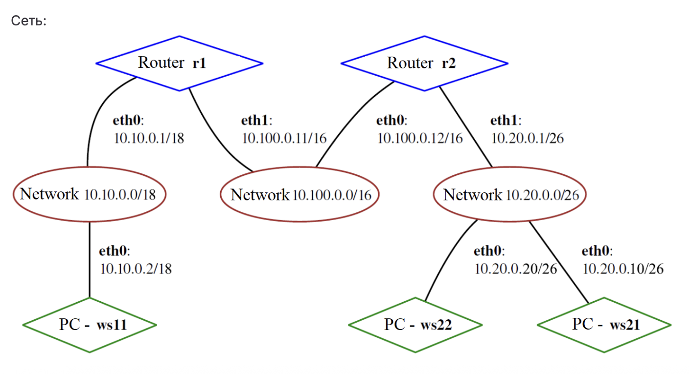

## Описание проекта  

Проект посвящён настройке сетей в Linux на виртуальных машинах. В процессе работы были выполнены следующие задачи:  

- Изучение стека протоколов **TCP/IP**, адресации и маршрутизации  
- Работа с утилитой **ipcalc** для анализа IP-адресов и масок  
- Настройка статической маршрутизации между машинами  
- Измерение скорости соединения с помощью **iperf3**  
- Настройка сетевого экрана с использованием **iptables** и **nmap**  
- Построение сетевой топологии и настройка маршрутов на нескольких узлах  
- Включение IP-переадресации и настройка маршрутов по умолчанию  
- Настройка протокола **DHCP** (динамическая выдача IP и привязка по MAC)  
- Настройка и проверка работы **NAT** (SNAT и DNAT)  
- Использование **SSH Tunnels** (локальное и удалённое TCP-перенаправление)  

Проект охватывает ключевые аспекты работы сетей в Linux: от базовой адресации и маршрутизации до настройки файрволов, NAT и безопасного удалённого доступа.  


### Part 1 Инструмент ipcalc

**1.1 Сети и маски**

Определить и записать в отчет
1) Адрес сети 192.167.38.54/13


2) Перевод маски 255.255.255.0 в префиксную и двоичную запись, /15 в обычную и двоичную, 11111111.11111111.11111111.11110000 в обычную и префиксную

3) Минимальный и максимальный хост в сети 12.167.38.4 при масках: /8, 11111111.11111111.00000000.00000000, 255.255.254.0 и /4

**1.2 localhost**

Определить и записать в отчет, можно ли обратиться к приложению, работающему на localhost, со следующими IP: 194.34.23.100, 127.0.0.2, 127.1.0.1, 128.0.0.1

**1.3. Диапазоны и сегменты сетей**

Определить и записать в отчет:

1) Какие из перечисленных IP можно использовать в качестве публичного, а какие только в качестве частных: 10.0.0.45, 134.43.0.2, 192.168.4.2, 172.20.250.4, 172.0.2.1, 192.172.0.1, 172.68.0.2, 172.16.255.255, 10.10.10.10, 192.169.168.1


2) Какие из перечисленных IP-адресов шлюза возможны у сети 10.10.0.0/18: 10.0.0.1, 10.10.0.2, 10.10.10.10, 10.10.100.1, 10.10.1.255


### Part 2. Статическая маршрутизация

**2.1 Настройка ВМ**

- Поднять 2 виртуальные машины. Названия: `ws1` и `ws2` 
- С помощью команды `ip a` посмотреть существующие сетевые интерфейсы. 
> Поместить скриншот в отчет.

- Указать какой сетевой интерфейс соответствует внутренней сети на обеих машинах.
- Задать следующие адреса и маски: `для ws1 - 192.168.100.10`, маска `/16`, `для ws2 — 172.24.116.8`, маска `/12`.

> Поместить в отчет скриншоты файлов etc/netplan/00-installer-config.yaml на каждой машине

- Использовать команду `netplan apply` для перезапуска сервиса сети

> Поместить скришот который будет отображать совершение этого действия в отчет


**2.2 Добавление статического маршрута вручную**

- С помощью команды `ip r add` добавить статический маршрут от одной машине к другой, пропинговать своединение
> Приложить скриншот отображающий выполненные действия

**2.3 Добавление статического маршрута с сохранением**
- Перезапустить машины
- С помощью файла  /etc/netplan/00-installer-config.yaml. добавить статический маршрут от одной машине к другой.
> Поместить скриншот с содержанием `netplan`

- Пропинговать соединение между ВМ
> Поместить скриншот с использованными командами

### Part 3. Утилита iperf3

> В данном задании используются машины ws1 и ws2 из Части 2

**3.1 Скорость соединения**

Перевести и записать в отчет
- 8 Mbps в MB/s
- 100 MB/s в Kbps
- 1 Gbps в Mbps

**3.2 Утилита iperf3**
- Измерить скорость соединения между ws1 и ws2
> Поместить скриншот с использованными командами

###Part 4. Сетевой экран

> В этом задании используются машины ws1 и ws2 из части 2

**4.1 Утилита iptables**

На машинах ws1 и ws2 создать файл `/etc/firewall.sh` который будет имитировать фаерволл со следующим содержимым:
```
#!/bin/sh

# Удаление всех правил в таблице «filter» (по умолчанию).
iptables -F
iptables -X
```
Нужно добавить подряд следующие правила:
1) На ws1 использовать стратегию когда в начале пишется запрещающее правило, а в конце разрешающее правило(касается пунктов 4 и 5)
2) На ws2 использовать противоположную стратегию когда в начале запрещение, а потом разрешение(касается пунктов 4 и 5)
3) Открыть доступ для портов 22 и 80 на обеих ВМ
4) Запретить echo reply. Машина не должна пинговаться, то есть должна быть блокировка на OUTPUT.
5) Разрешить echo reply. Машина должна пинговаться
> В отчет поместить скриншот с содержанием /etc/firewall на обеих ВМ

Использовать команды `chmod +x /etc/firewall.sh` и `/etc/firewall.sh` для запуска файлов на обеих машинах

> В отчет поместить скриншоты с запуском. А также описать разницу между стратегиями (разрешение/запрещение)

**4.2 Утилита nmap**

Найти машину которая не пингуется при помощи команды `ping`, далее использовать nmap чтобы показать что хост ВМ запущен. В выводе nmap должно быть: `Host is up`
> В отчет поместить скриншоты где видно использование ping и nmap

### Part 5. Статическая маршрутизация сети



**5.1 Настройка адресов машин**
- Поднять 5 ВМ и настроить их конфигурации (etc/netplan/00-installer-config.yaml) согласно картинке. Приложить скриншоты файлов конфигураций в отчет.
- Перезапустить сервис сети. Использовать `ip -4 a` для проверки что адреса заданы верно. Пропинговать ws22 с ws21, также r1 c ws11. Приложить скриншоты с использованием команд.

**5.2 Переадресация IP-адресов**
- Выполнить команду `sysctl -w net.ipv4.ip_forward=1` на роутерах. Приложить скриншот
> При таком подходе переадресация работает только до перезагрузки системы
- Добавить в файл `/etc/sysctl.conf` строку `net.ipv4.ip_forward = 1`. Приложить скриншот.
> При таком подходе переадресация будет включена на постоянной основе

**5.3 Установка маршрута по умолчанию**
```
default via 10.10.0.1 dev eth0
10.10.0.0/18 dev eth0 proto kernel scope link src 10.10.0.2
```
Сверху представлен пример вывода при использовании команды `ip r` после добавления шлюза

- Надо настроить маршрут по умолчанию(шлюз) для ВМ. Надо добавить `default` перед IP роутера в конфигурационном файле.
	- Добавить скриншот в отчет
- Вызвать `ip r` для того чтобы отобразить что маршрут был добавлен
	- Добавить скриншот в отчет
- С помощью команды `tcpdump -tn -i eth0` пропинговать r2 с ws11.
	- Добавить скриншот в отчет

**5.4 Добавление статических маршрутов**

- Добавить статические маршруты для роутеров r1 и r2. Ниже представлен пример маршрута для r1 в сетку 10.20.0.0/26:
```
# Добавь в конец описания сетевого интерфейса eth1:
- to: 10.20.0.0
  via: 10.100.0.12
```

- Добавить скриншоты файлов etc/netplan/00-installer-config.yaml для каждого роутера

- Использовать `ip r` для отображения таблиц с маршрутами. Добавить скриншот в отчет.

- Использовать команды `ip r list 10.10.0.0/[маска сети]` и `ip r list 0.0.0.0/0`, добавить скриншоты в отчет
- В отчете объяснить почему для адреса 10.10.0.0/[маска сети] был выбран маршрут, отличный от 0.0.0.0/0, хотя он попадает под маршрут по умолчанию.

**5.5 Построение списка маршрутизаторов**

Ниже представлен пример вывода traceroute после добавления шлюза
```
1 10.10.0.1 0 ms 1 ms 0 ms
2 10.100.0.12 1 ms 0 ms 1 ms
3 10.20.0.10 12 ms 1 ms 3 ms
```

- На r1 запустить команду дампа `tcpdump -tnv -i eth0`
- С помощью утилиты **traceroute** построить список маршрутизаторов на пути от ws11 до ws21
- Добавить в отчет скриншоты где видно использование tcpdump и traceroute. Опираясь на вывод из дампа на r1 объяснить принцип работы построения пути при помощи traceroute. 

**5.6 Протокол ICMP при маршрутизации**

- При помощи команды `tcpdump -n -i eth0 icmp` запустить перехват трафика на r1 который проходит через eth0
- При помощи команды `ping -c 1 10.30.0.111` пропинговать несуществующий IP с машины ws11
- Добавить скриншоты в отчет

###Part 6. Динамическая настройка IP с помощью DHCP
**В этом задании используются машины из Части 5**

- Настроить конфигурацию службы DHCP для r2 в файле /etc/dhcp/dhcpd.conf. Указать адрес маршрутизатора по умолчанию, DNS-сервер и адрес внутренней сети. Пример ниже
```
subnet 10.100.0.0 netmask 255.255.0.0 {}

subnet 10.20.0.0 netmask 255.255.255.192
{
    range 10.20.0.2 10.20.0.50;
    option routers 10.20.0.1;
    option domain-name-servers 10.20.0.1;
}
```

- В файле `resolv.conf` прописать `nameserver 8.8.8.8`
	- Добавить в отчет скриншоты

- Использовать команду `systemctl restart isc-dhcp-server` для перезагрузки службы DCHP. Перезапустить ws21 с помощью `reboot`, далее с помощью `ip a` показать что она получила адрес. Пропинговать ws22 с ws21.
	- Добавить в отчет скриншоты

- Указать MAC-адрес у ws11. В etc/netplan/00-installer-config.yaml надо добавить строки `macaddress: 10:10:10:10:10:BA`, `dhcp4: true`
	- Добавить в отчет скриншоты
- Для r1 сделать аналогичные с r2 настройки, но с жесткой привязкой к MAC-адресу. Провести аналогичные тесты
	- Добавить в отчет скриншоты
- С ws21 запросить обновление IP-адреса
	- Добавить в отчет скриншоты IP до и после обновления.
	- В отчете описать какие опции DHCP сервера были использованы в этом пункте

### Part 7. NAT

**В этом задании используются машины из Части 5**

- На ws22 и r1 в файле /etc/apache2/ports.conf изменить строку `Listen 80` на `Listen 0.0.0.0:80`. Это сделает сервер Apache2 общедоступным.

	- Добавить в отчет скриншот измененного файла
- Запустить Apache c с помощью команды `service apache2 start` на ws22 и r1
	- Добавить в отчет скриншот

- В фаервол, созданный по аналогии с фаерволом из Части 4 добавить следующие правила
	- `iptables -F` (удаление правил в таблице filter)
	- `iptables -F -t nat` (удаление правил в таблице NAT)
	- `iptables --policy FORWARD DROP` (отбрасывать все маршрутизируемые пакеты) 

- Запустить файл аналогично файлу из части 4. При запуске этого файла ws22 не должна пинговаться с r1.
	- Добавить скриншоты в отчет

- Добавить в файл еще одно правило которое будет разрешать маршрутизацию всех пакетов ICMP. Запустить файл, проверить соединение между ws22 и r1, пинг должен проходить.
	- Добавить скриншоты в отчет

- **Добавить еще 2 правила**
- Включить SNAT, все локальные IP находящиеся за r2 должны маскироваться
- Включить DNAT на 8080 порт r2 и добавить к веб-серверу Apache, запущенному на ws22, доступ извне сети
	- Добавить скриншоты
- Запустить файл (Перед тестированием рекомендуется отключить сетевой интерфейс NAT)

-  **Проверить соединение по TCP для SNAT**. Для этого надо подключиться к серверу Apache на r1 с ws22 с помощью команды `telnet [адрес] [порт]` 
- **Проверить соединение по TCP для DNAT**. Для этого надо с r1 подключиться к серверу Apache на ws22 командой telnet (обращаться по адресу r2 и порту 8080).
	- Добавить скриншоты в отчет

### Part 8. SSH Tunnels

В данном задании используются виртуальные машины из Части 5.

- Запустить фаерволл из Части 7 на r2
- Запустить Apache на ws22 только на localhost(в конфигурационном файле Apache изменить строку `Listen 80` на `Listen localhost:80`)
- Для получения доступа к веб-серверу на ws22 с ws21 надо использовать Local TCP forwarding с ws21 до ws22
- Для получения доступа к веб-серверу на ws22 с ws11 надо использовать Remote TCP forwarding с ws11 до ws22
- Для теста успешности подключения перейти во второй терминал и выполнить команду `telnet 127.0.0.1 [локальный порт]`
	- Добавить в отчет скриншоты, а также описание использованных команд.
