# DO2 Task Report   
## Part 1   
### 1.1   
1. **Адрес сети для IP 192.167.38.54/13:**   
    - 192.160.0.0/13   
2. **Переводы между разными способами записи масок**   
    - Перевод маски 255.255.255.0    
        - Префиксная запись: /24   
        - Двоичная запись: 11111111.11111111.11111111.00000000   
    - Перевод /15   
        - Обычная запись: 255.254.0.0   
        - Двоичная запись: 111111111.11111110.00000000.00000000   
    - Перевод 11111111.11111111.11111111.11110000   
        - Обычная запись: 255.255.240   
        - Префиксная запись: /28   
3. Минимальный и максимальный хост для айпи 12.167.38.4
   
    - маска /8   
        - мин хост - 12.0.0.1   
        - макс хост - 12.255.255.254   
    - маска 11111111.11111111.00000000.00000000   
        - мин хост - 12.167.0.1   
        - макс хост - 12.167.255.254   
    - маска 255.255.254.0   
        - мин хост - 12.167.38.1   
        - макс хост - 12.167.39.254   
    - маска /4   
        - мин хост - 0.0.0.1   
        - макс хост - 15.255.255.254   
   
   
   
### 1.2   
- Для того чтобы определить можно ли обратиться к приложению, надо определить попадает ли IP адрес в диапазон 127.0.0.0/8(от 127.0.0.1 до 127.255.255.254) потому что этот диапазон зарегистрирован под lookback    
- То есть:   
    - 194.34.23.100 - нельзя   
    - 127.0.0.2 - можно    
    - 127.1.0.1 - можно    
    - 128.0.0.1 - нельзя    
   
### 1.3   
**Часть 1**    
- Для того чтобы определить частный или публичный IP, надо посмотреть попадает ли IP в диапазоны 10.0.0.0 – 10.255.255.255, 172.16.0.0 – 172.31.255.255, 192.168.0.0 – 192.168.255.255. Если попадает, то это локальный айпи, а если нет то публичный.    
- То есть:   
    - 10.0.0.45 - частный    
    - 134.43.0.2 - публичный    
    -  192.168.4.2 - частный   
    -  172.20.250.4 - частный    
    -  172.0.2.1 - публичный    
    -  192.172.0.1 - публичный   
    -  172.68.0.2 - публичный    
    -  172.16.255.255 - частный   
    -  10.10.10.10 - частный   
    -  192.169.168.1 - публичный   
   
**Часть 2**   
- Шлюз должен находиться в той же сети, чтобы другие устройства могли отправлять пакеты именно на него напрямую. В данном случае 10.10.0.1 – 10.10.63.254.   
- То есть:   
    - 10.0.0.1 - не подходит    
    - 10.10.0.2 - подходит   
    - 10.10.10.10 - подходит   
    - 10.10.100.1 - не подходит   
    - 10.10.1.255 - подходит    
   
   
   
## Part 2   
   
- Скриншот с сетевыми интерфейсами ws1
   
    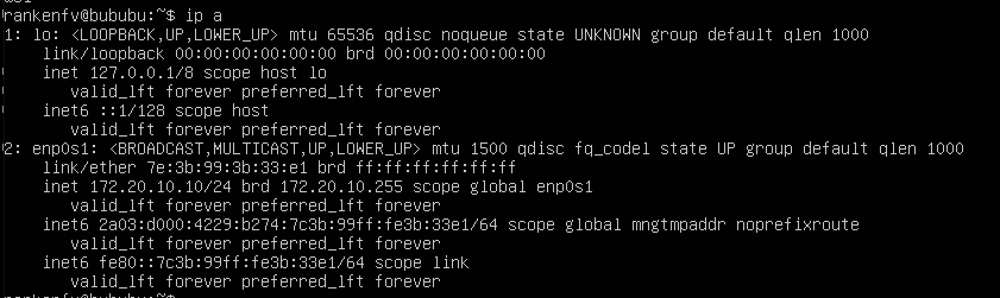    
- Скриншот с сетевыми интерфейсами ws2   
    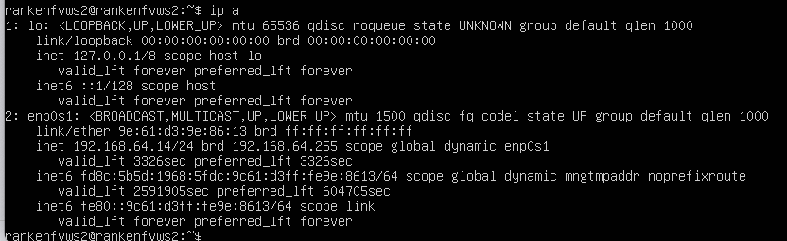    
   
   
- скриншот с измененным конфиг файлом на ws1   
    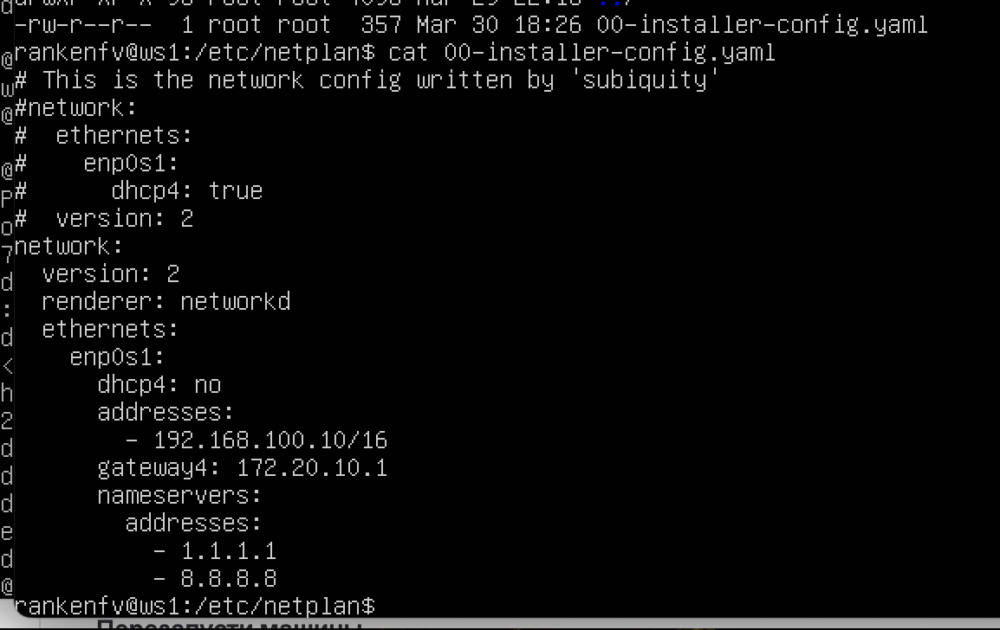    
- Применение изменений на машине ws1 с помощью команды `netplan apply`   
        
   
    
- Скриншот с демонстрацией обновленного айпи адреса у машины ws1   
    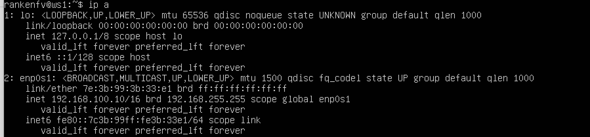    
   
   
- Скриншот с демонстрацией содержимого netplan файла на машине ws2   
    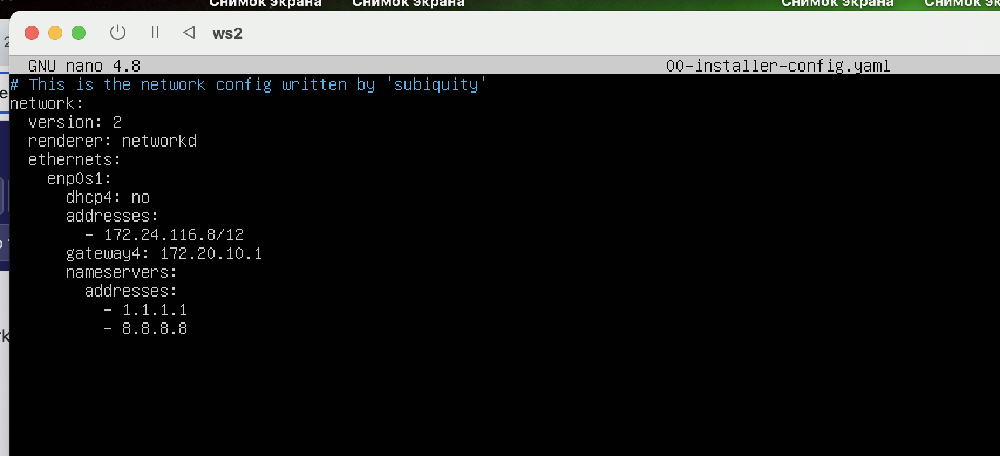    
- Скриншот на котором видно использование команды netplan apply, а также обновленный ip адрес на машине ws2   
    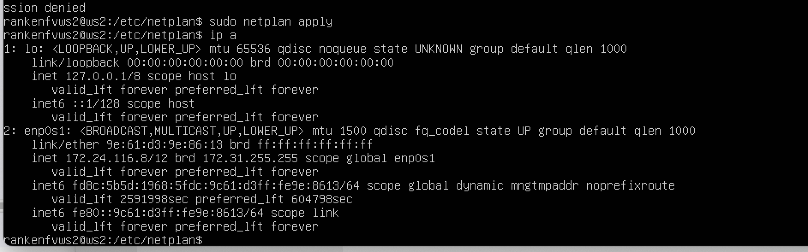    
   
   
   
### 2.1   
   
- `sudo ip route add <сеть> via <IP-шлюза> dev <интерфейс>`   
    - Использовался такой синтаксис потому что машины находятся в разных подсетях и для их соединения нужен шлюз   
   
   
   
- Скриншот с примененным конфигом на ws2 и выводом команды ip a, показывающим что айпи был обновлен согласно заданию    
    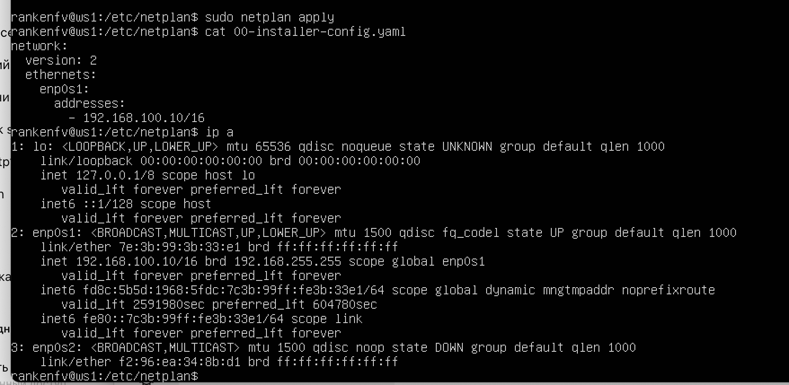    
- Скриншот с примененным конфигом на ws2 и выводом команды ip a, показывающим что айпи был обновлен согласно заданию    
    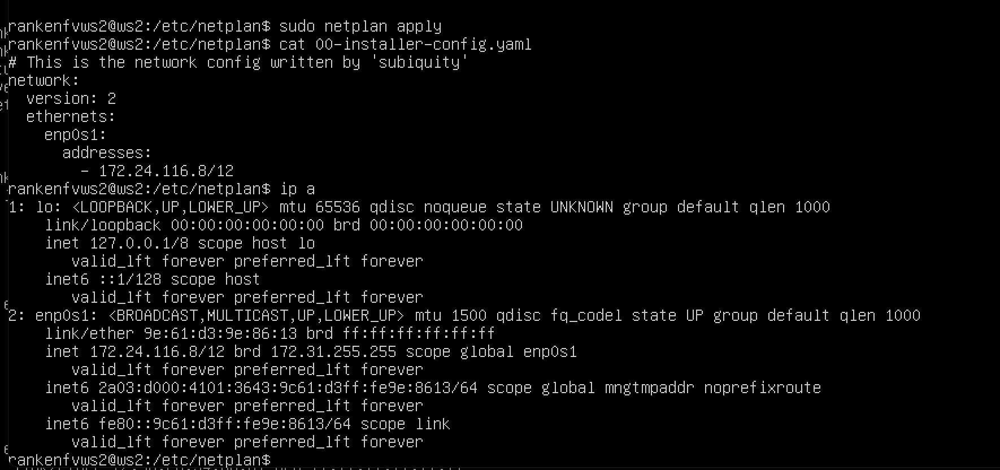    
- Так как машины находятся в разных подсетях, я добавила второй интерфейс который дал возможность связать их в одну сеть 

   
- Скриншот который демонстрирует новый интерфейс на машине ws1 - enp0s2   
    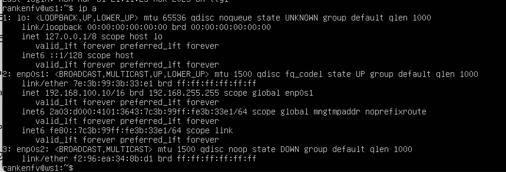    
- Скриншот который демонстрирует новый интерфейс на машине ws2 - enp0s2   
    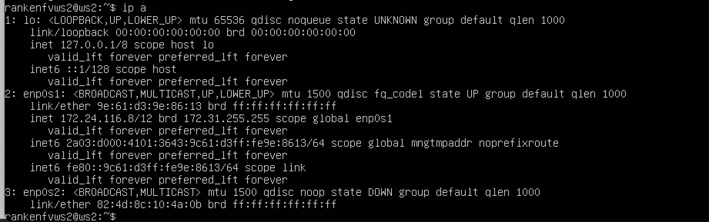    
   
   
- После этого я добавила общую сеть для 2х машин через нетфайл   
- Скриншот с выводом обновленного файла на ws1   
    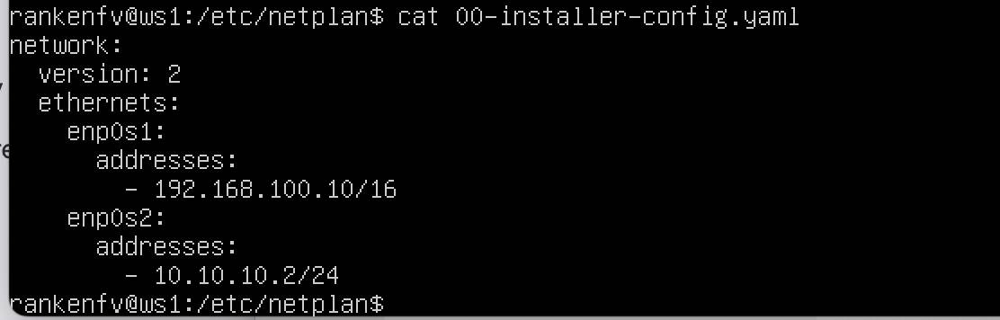    
- Скриншот с выводом обновленного файла на ws2   
    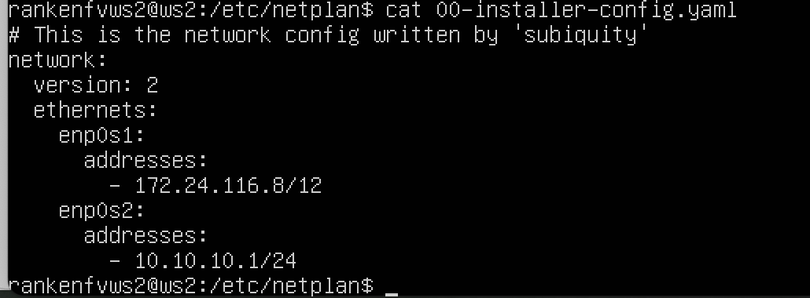    
   
   
- Скриншот который показывает обновленный вывод ip a на машине ws1   
    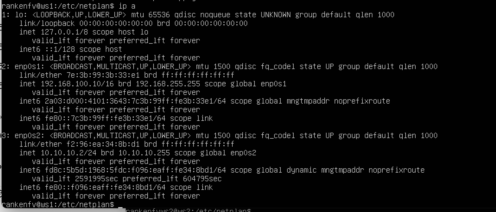    
- Скриншот который показывает обновленный вывод ip a на машине ws2   
    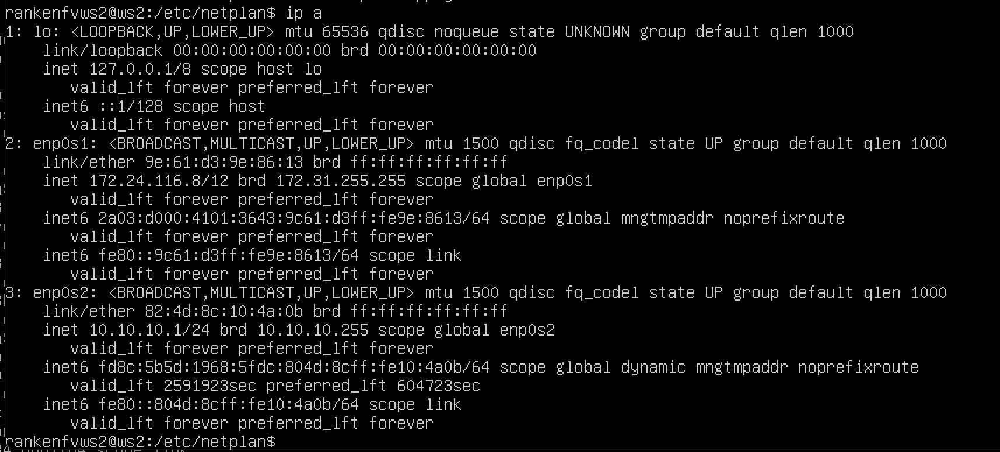    
   
   
   
- Скриншот где показано ручное добавление маршрута, а также что пинг с ws2 на ws1 проходит    
    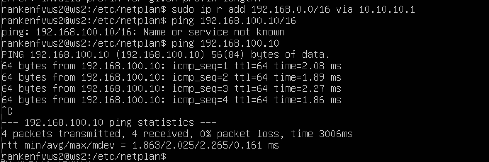    
- Скриншот где показано ручное добавление маршрута, а также что пинг с ws1 на ws2 проходит    
    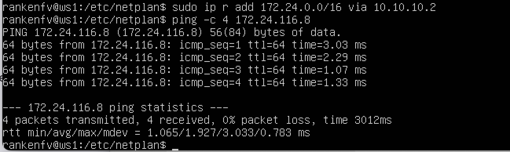    
       
   
   
### 2.2   
   
- Обновленный и примененный netplan файл c помощью команды `sudo netplan apply` на машине ws1   
    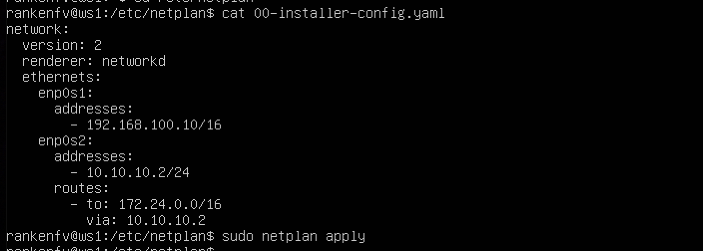    
- Обновленный и примененный netplan с помощью команды `sudo netplan apply` на машине ws2   
        
   
   
- Скриншот который показывает что пинг проходит с ws1 на ws2 после перезагрузки c помощью команды `sudo reboot`   
    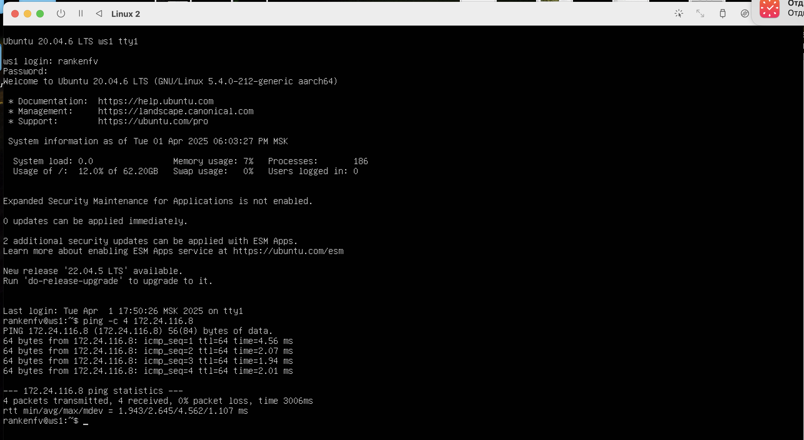    
   
   
- Скриншот который показывает что пинг проходит с ws2 на ws1 после перезагрузки c помощью команды `sudo reboot`

   
    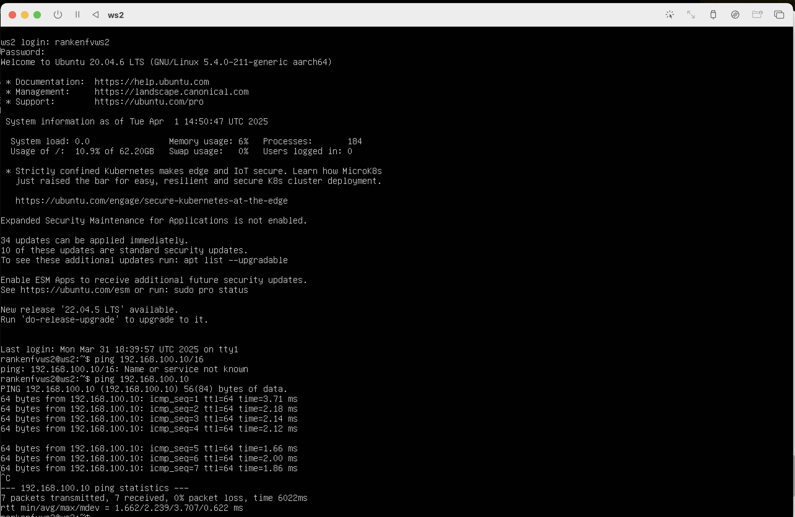    
   
   
   
## Part 3   
   
### 3.1   
- **8 Mbps  → 1 MB/s**   
    - Mbps - это мегабит/сек    
    - MB/s - это мегабайт/сек    
    - 1 байт = 8 бит → надо делить на 8 
**Следовательно: 8 Mbps = 1 MB/s**   
   
   
- **100 MB/s → 800 000 Kbps (десятичная система перевода) 

**   
    - Десятичная система   
        - В сетевых технологиях, таких как iperf3, принято использовать десятичную систему единиц, где:   
            1 MB = 1,000,000 байт   
            1 байт = 8 бит   
            1 Kbps = 1,000 бит
Следовательно:
100 MB/s → байты/сек→ биты/сек → килобиты
   
             100 MB/s × 1,000,000 = 100,000,000 байт/с
100,000,000 × 8 = 800,000,000 бит/с
800,000,000 ÷ 1,000 = **800,000 Kbps**
   
    - Бинарная логика вычислений:    
        MB → килобайты → байты → биты → килобиты 
100MB х* 1024 = 102 400KB
102 400 килобайт х 1024 = 104 857 600 байт
104 857 600 байт х 8 = 838 860 800 бит
838 860 800 бит / 1024 = **819 200 килобит***   
- **1 Gbps → 1000 Mbps**   
    Gbps → бит/сек → мегабит/сек   
    1 Gbps × 1,000,000,000 = 1,000,000,000 бит/сек   
    бит/сек → мегабит/сек   
    1,000,000,000 бит/сек ÷ 1,000,000 = 1000 Mbps   
   
   
- Я использовала десятичную систему счисления при переводе потому что для отражения скорости принято использовать ее, есть еще бинарный способ перевода, но он используется для отражения хранения информации, а не скорости передачи    
   
   
### 3.2   
   
- Для выполнения этого задания я в начале установила утилиту iperf3 с помощью команды `sudo apt install iperf3`   
   
   
- Скриншот который показывает установку утилиты iperf3 на машине ws1   
    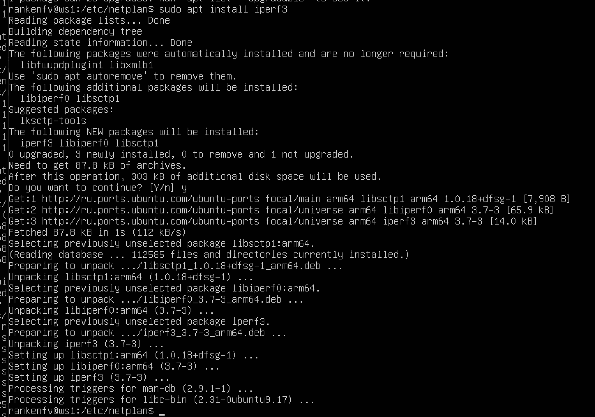    
- Скриншот который показывает установку утилиты iperf3 на машине ws2   
    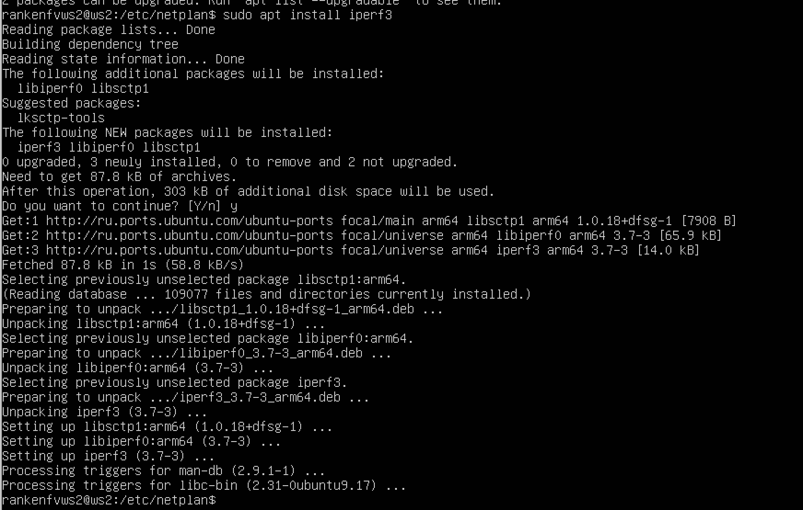    
- Для того чтобы измерить скорость соединения между машинами с помощью установленной утилиты, на машине ws2 я ввела в командной строке iperf -s, что означает что данная машина слушала и принимала информацию, на машине ws1 в свою очередь я ввела в терминале iperf3 -c 172.24.116.8 Данная машина была отправителем данных для измерения скорости соединения 

   
- Скриншот который показывает работу утилиты iperf3 на машине ws1   
    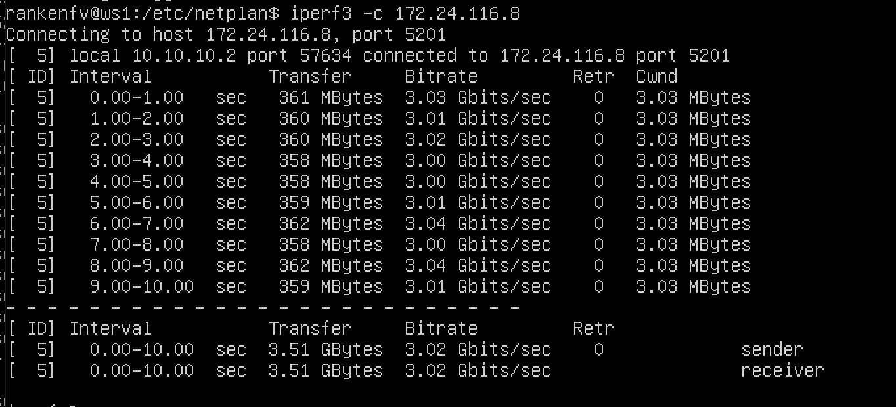    
- Скриншот который показывает работу утилиты iperf3 на машине ws2

   
    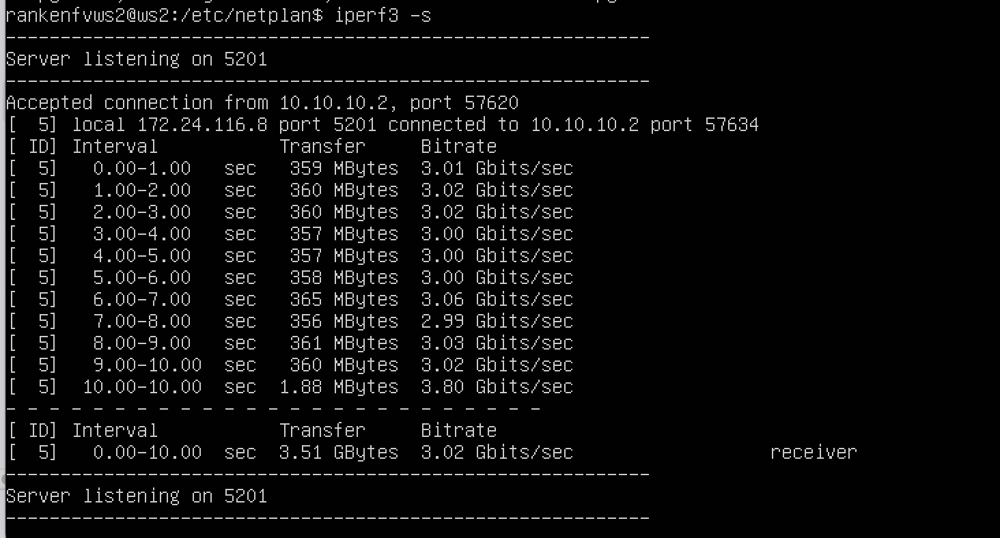    
   
   
- В результате измерения скорости соединения между ws1(отправитель) и ws2(получатель) с помощью утилиты iperf3, средняя скорость передачи данных составила **3.02 Gbit/s**.   
   
   
- Также я решила проверить скорость соединения в обратную сторону    
   
   
- Скриншот который показывает работу утилиты iperf3 на машине ws1   
    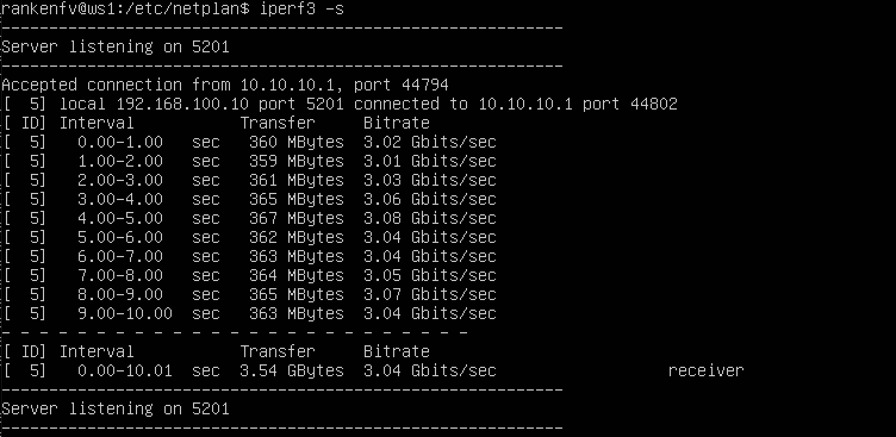    
- Скриншот который показывает работу утилиты iperf3 на машине ws2   
    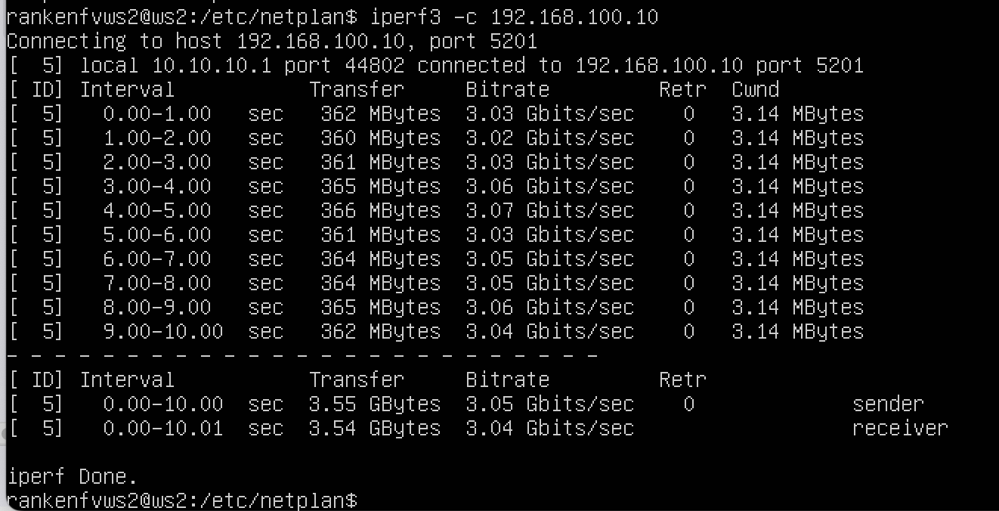    
- В результате измерения скорости соединения между ws1(отправитель) и ws2(получатель) с помощью утилиты iperf3, средняя скорость передачи данных составила **3.05 Gbit/s**.   
   
   
- Взяв среднее значение между двумя измерениями можно сказать что **скорость соединения машин ws1 и ws2 составляет 3.04 Gbit/s.**   
   
   
   
## Part 4   
   
### 4.1   
   
- содержимое файла firewall.sh на машине ws1   
    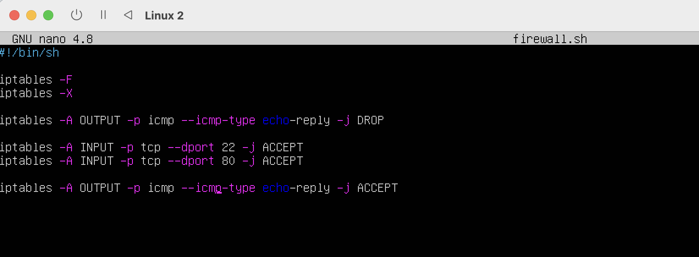    
- содержимое файла firewall.sh на машине ws2   
    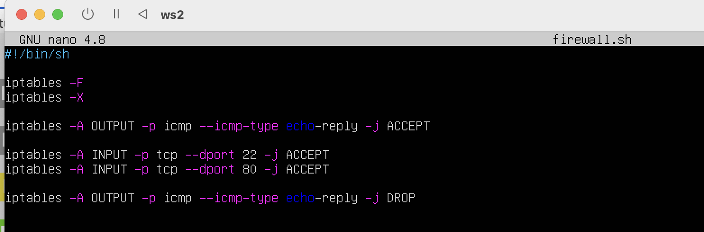    
   
   
   
- Скриншот который показывает добавление прав на исполнение скрипта на машине ws1, запуск скрипта и вывод таблицы с помощью команды` -iptables  -L -v -n ` где видно что скрипт отработал верно и все нужные правила применились 

   
    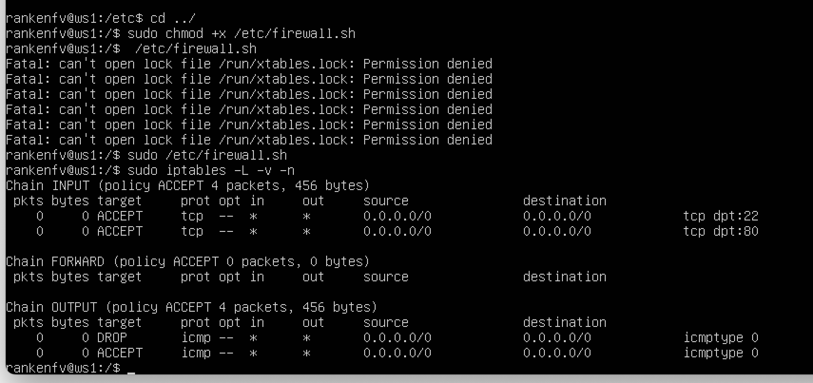    
   
   
- Скриншот который показывает добавление прав на исполнение скрипта на машине ws2, запуск скрипта и вывод таблицы с помощью команды` -iptables  -L -v -n ` где видно что скрипт отработал верно и все нужные правила применились    
    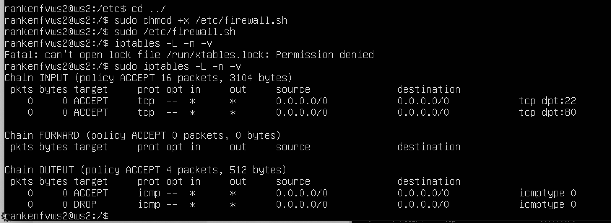    
   
   
- Стратегия на ws1 — это подход с жёстким контролем и блокировкой по умолчанию. В такой стратегии первым делом устанавливаются запрещающие правила, а затем явно разрешается только нужный трафик. Это безопасный подход: всё, что не разрешено — запрещено. Он полезен в системах с повышенными требованиями к безопасности, где необходимо чётко контролировать каждый вид сетевой активности.   
- Стратегия на ws2 — более открытый и гибкий подход. Сначала устанавливаются разрешающие правила — допускается нужный трафик, а в конце ставится запрещающее правило, чтобы отсечь всё остальное. Такой метод упрощает настройку, когда известно, что нужно пропустить, а остальное можно "отфильтровать" в конце. Он может быть менее безопасным, если случайно пропустить лишнее в начале.   
   
   
- Если кратко:   
    - ws1: политика "блокировать всё, кроме явно разрешённого"   
    - ws2: политика "разрешать нужное, остальное блокировать в конце"   
   
   
### 4.2   
   
- Скриншот который показывает что машина ws1 не пингуется с машины ws2   
    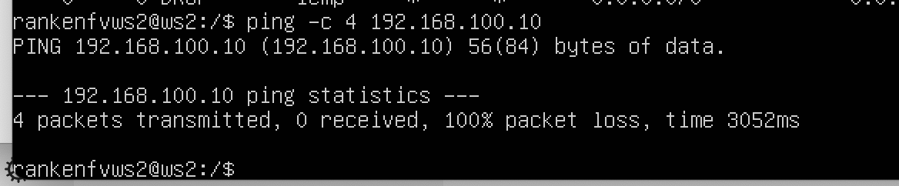    
- Скриншот который показывает что машина ws2 пингуется с машины ws1   
    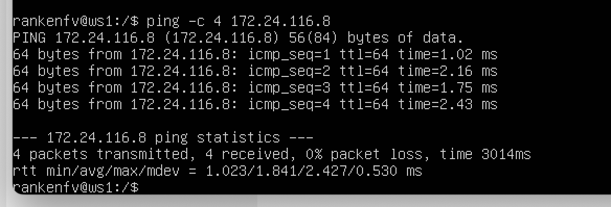    
   
   
- Скриншот который показывает работу nmap на машине ws2, результат работы показывает "Host is up", что означает что машина ws1 была включена на момент сканирования, но не реагировала на пинг   
    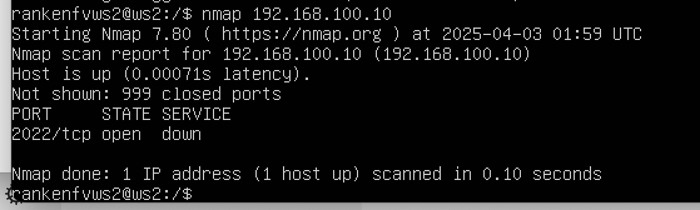    
   
   
## Part 5   
   
- Скриншот который показывает наличие 5ти виртуальных машин    
    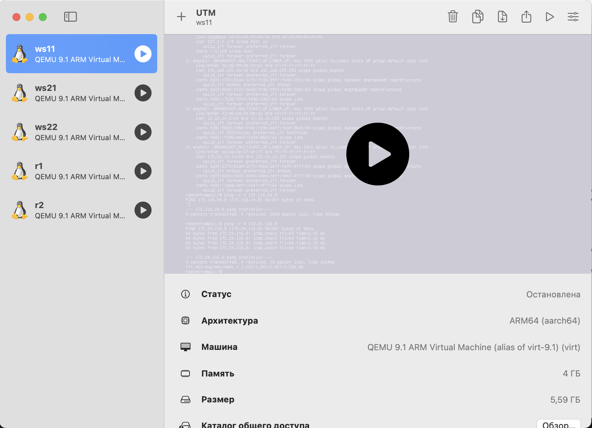    
   
   
### 5.1   
    
-  eth0 и eth1 - это отображение железа, а не логики маршрутизации. Поэтому я использовала интерфейсы enp0s1(s2,s3) потому что это те интерфейсы которые доступны на моей технике.    
   
   
- Машина ws22 

   
    - скриншот с содержанием нетплан файла
   
        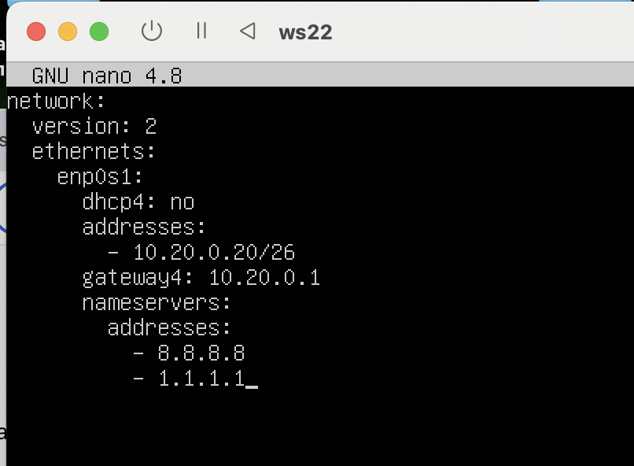    
    - вывод команды ip -4 a после перезагрузки машины    
        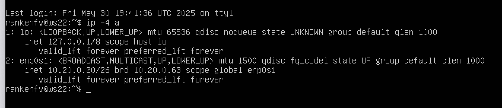    
- Машина ws21   
    - Скриншот с содержанием нетплан файла   
        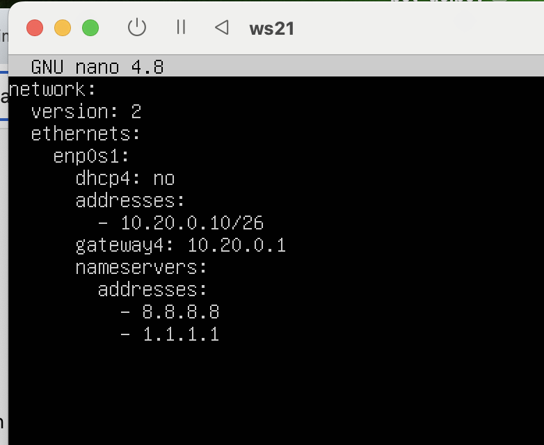    
    - вывод команды ip -4 a после перезагрузки   
        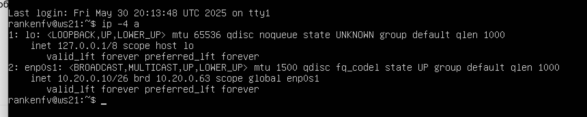    
   
   
- Машина ws11   
    - Скриншот с содержанием нетплан файла   
        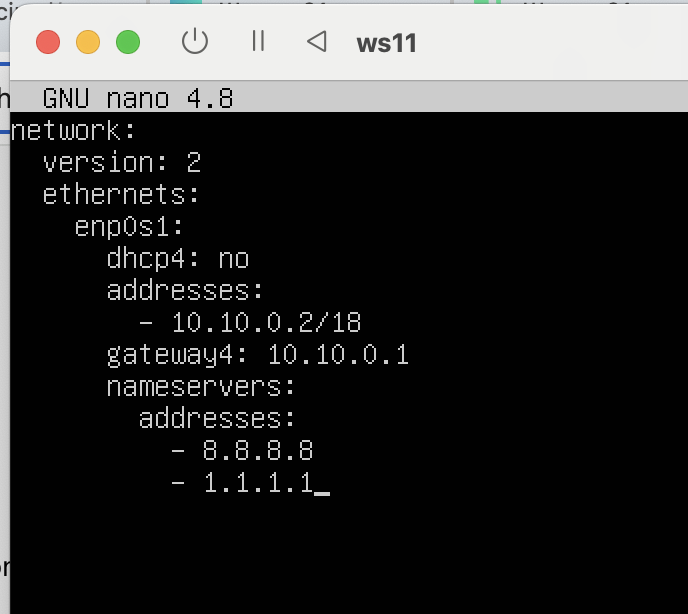    
    - вывод команды ip -4 a после перезагрузки   
        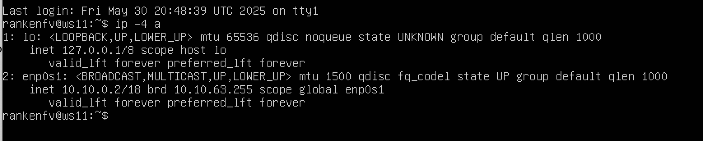    
   
   
- Машина r1   
    - Скриншот с содержанием нетплан файла    
        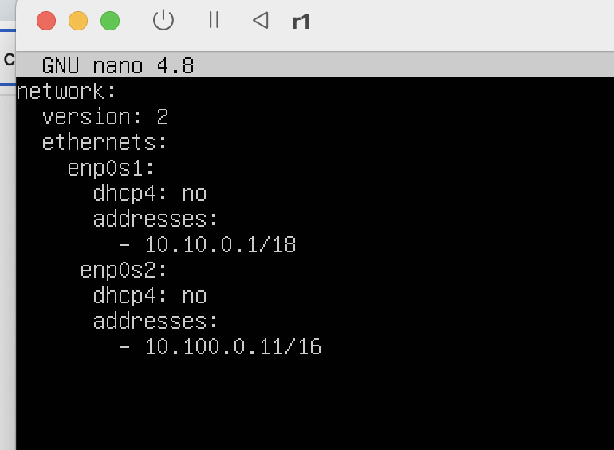    
    - вывод команды ip -4 a после перезагрузки   
        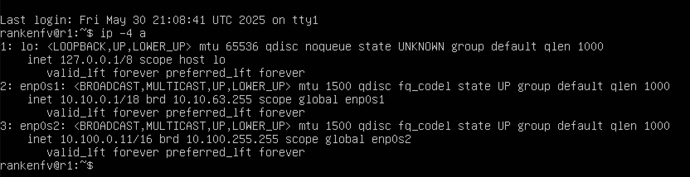    
   
   
- роутер r2   
    - Скриншот с содержанием нетплан файла    
        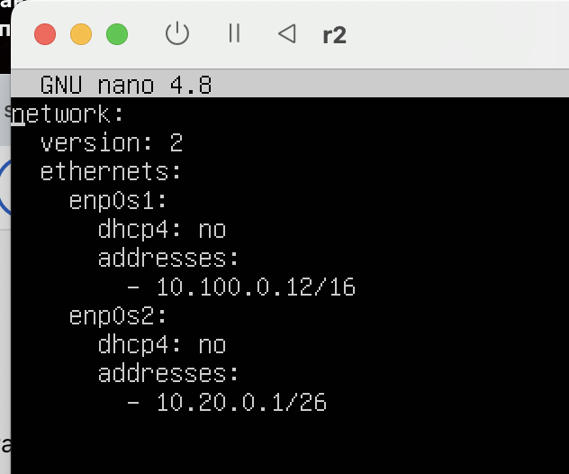    
    - вывод команды ip -4 a после перезагрузки   
        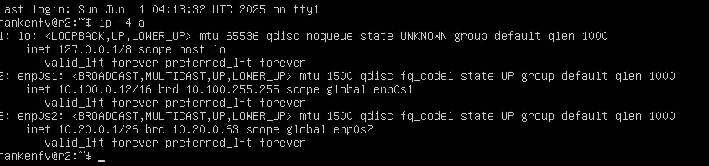    
   
   
   
- пинг с машины ws21 на машину ws22   
    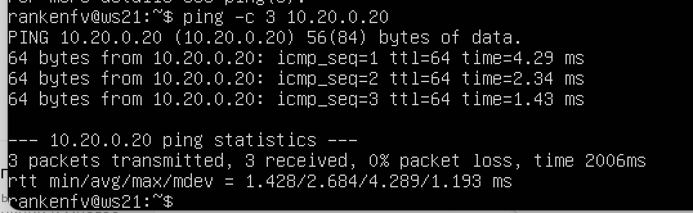    
- пинг с машины ws11 на роутер r1   
    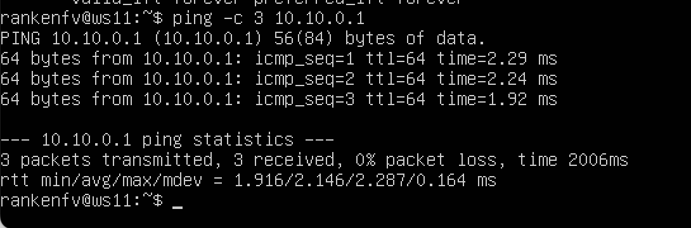    
   
   
### 5.2   
   
- скриншот который показывает включенную переадресацию на роутере r1   
    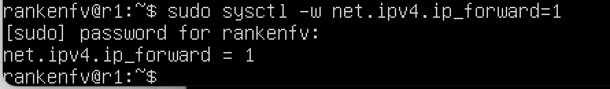    
- скриншот который показывает включенную переадресацию на роутере r2   
    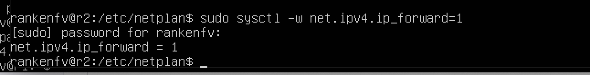    
   
   
   
- Скриншот с измененным sysctl файлом на машине r2   
    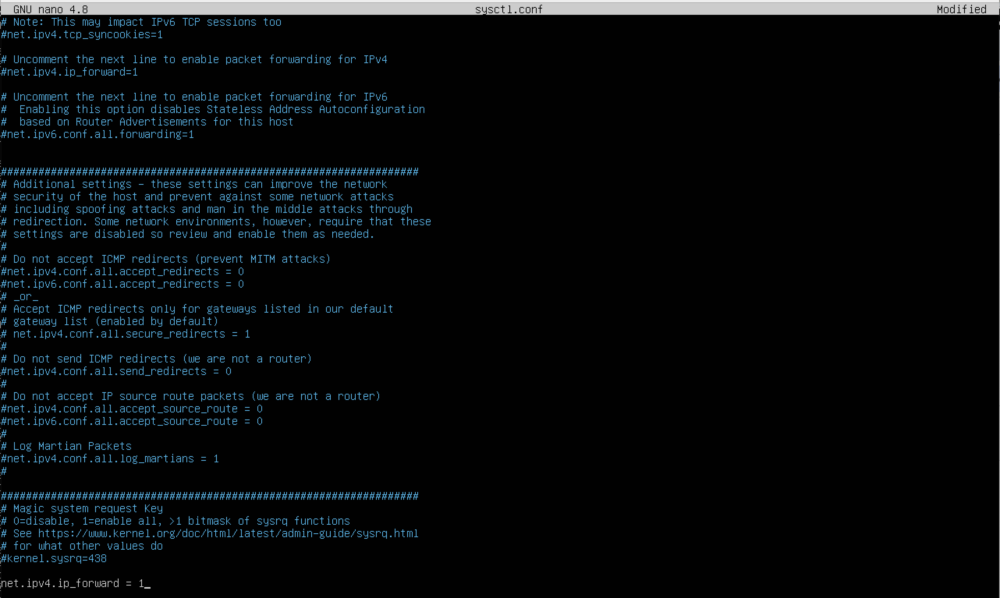    
- Скриншот с измененным sysctl файлом на машине r1   
    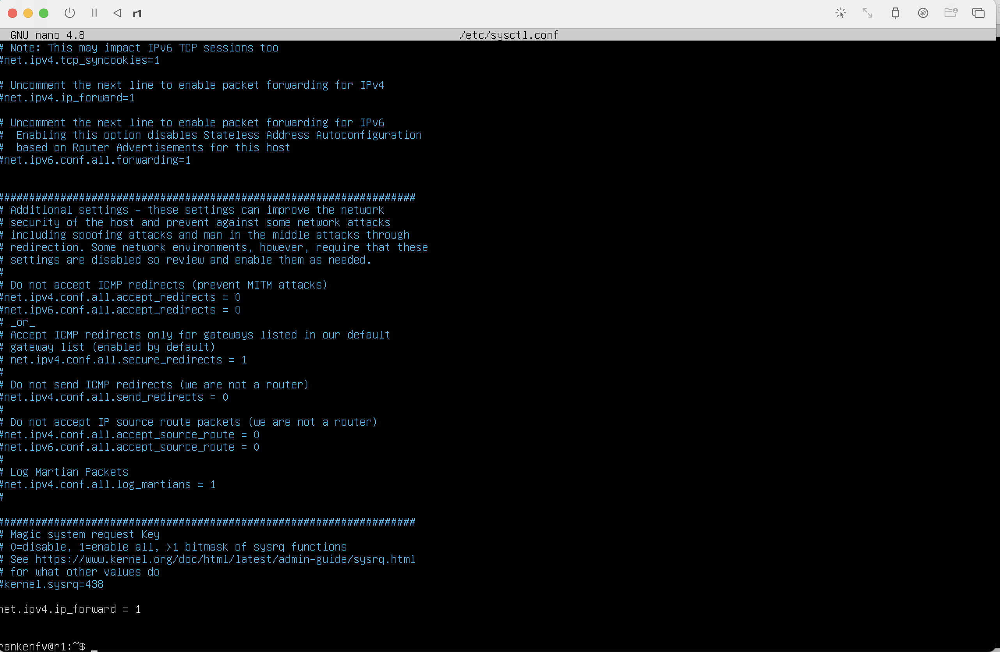    
   
   
### 5.3   
   
- Машина ws11   
    - Скриншот с измененным нетплан файлом    
        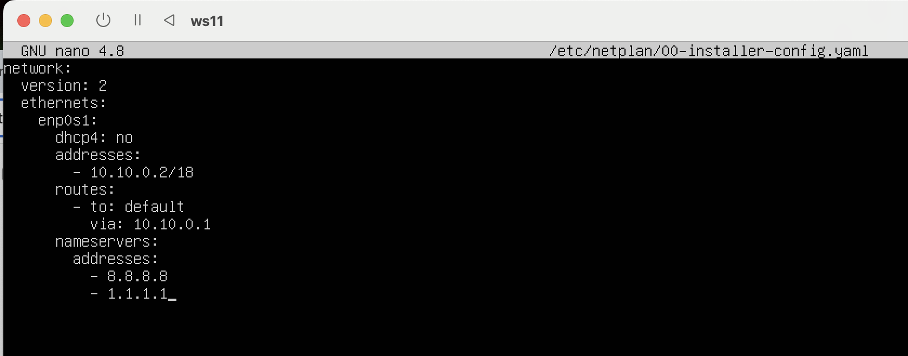    
    - Скриншот с вызовом и выводом команды ip r   
            
   
   
- Машина ws22   
    - Скриншот с измененным нетплан файлом    
            
    - Скриншот с вызовом и выводом команды ip r   
            
   
   
- Машина ws21   
    - Скриншот с измененным нетплан файлом    
            
    - Скриншот с вызовом и выводом команды ip r   
            
   
   
   
- Скриншот с пингом с машины ws11 на роутер r2   
        
- Скриншот с дампом на роутере r2   
        
   
   
   
### 5.4   
   
- Роутер r1   
    - Скриншот с обновленным содержанием нетплан файла   
            
    - Скриншот с таблицей маршрутов на роутере r1    
            
   
    
   
- роутер r2   
    - Скриншот с обновленным содержанием нетплан файла   
            
    - Скриншот с таблицей маршрутов на роутере r2   
            
    - Скриншот с выводом команды на машине ws11 `ip r list 10.10.0.0/[18]`   
            
    - Скриншот с выводом команды на машине ws11 `ip r list 0.0.0.0/0`   
            
- `ip r list 10.10.0.0/18` — показывает конкретный маршрут для сети 10.10.0.0, то есть локальный сегмент, напрямую доступен через интерфейс enp0s1.   
- `ip r list 0.0.0.0/0` — это маршрут по умолчанию, применяется для всех пакетов, не попадающих в другие маршруты, и указывает на шлюз 10.10.0.1 (то есть r1).   
   
### 5.5   
   
- Скриншот экрана роутера r1 где видно прохождение пакетов после использования команды tcpdump    
        
- Скриншот вывода утилиты traceroute на машине ws11   
        
   
   
- Принцип работы traceroute:   
    - traceroute использует ICMP или UDP и отправляет пакеты с разным TTL (time to live)   
    - Каждый маршрутизатор по пути уменьшает TTL на 1   
    - Когда TTL = 0 — маршрутизатор отправляет ICMP-сообщение Time Exceeded   
    - Эти ICMP-ответы и формируют список маршрутизаторов на пути   
- ICMP — это протокол управления сообщениями, который не используется для передачи данных, а нужен для диагностики и ошибок. Грубо говоря это тип сообщения которое отправляют машины другой машине которое говорит о том что происходит. То есть к примеру машина получает пакет и говорит другой машине "я получила пакет" или "не получила"
   
- UDP — это протокол быстрой доставки, но без гарантии доставки. Он не проверяет, получил ли получатель сообщение и не пытается повторно отправить если что-то потерялось. Просто отправляет и забывает.    
   

   
### 5.6   
   
- Скриншот с пингом несуществующего адреса с машины ws11   
        
   
   
- Скришот с роутера r1 где видно что указанная сеть недоступна   
        
   
#    
   
## Part 6   
   
- **работа с r2**    
    - Скриншот конфигурационного файла службы DHCP для r2   
            
    - Скриншот который показывает добавление nameserver 8.8.8.8 в resolv.conf на роутере r2   
            
    - Скриншот который показывает перезагрузку службы dhcp на роутере r2   
            
- **работа с ws21**   
    - Скриншот который показывает процесс перезагрузки машины ws21 c помощью команды sudo reboot   
            
    - Скриншот где видно что машина ws21 успешно получила IP по DHCP из диапазона 10.20.0.2–50   
            
   
    На интерфейсе enp0s1 видно:   
    inet 10.20.0.10/26 brd 10.20.0.63 scope global enp0s1   
    IP-адрес - 10.20.0.10   
    Маска - /26    
    ширина - /26 дает диапазон в 64 адреса (с 10.20.0.0 по 10.20.0.63)
dhcp сервер выдал не самый первый доступный адрес потому что мб он уже выдавал клиентам адреса и они не были очищены (dhcp сервер может быть не очищен) 
   
       
- Скриншот на котором видно айпи на ws22   
        
- Скриншот пинга с машины ws21 на машину ws22   
        
   
   
   
- Машина ws11   
    - Скриншот на котором видно измененный и примененный нетплан файл согласно заданию    
            
   
   
   
   
- **Роутер r1**   
    - Скришот с измененным dhcp конфигом на роутере r1   
            
        `host ws11` — создаёт **жесткую привязку**:   
        Если клиент с MAC `10:10:10:10:10:BA` — ему всегда выдается `10.10.0.100`   
    - Скриншот который показывает перезапуск службы dhcp и вывод команды status который показывает что dhcp сервер работает как надо на интерфейсе enp0s1    
            
   
   
- **Машина ws11**   
    - Скриншот нетплан файла машины ws11 
   
            
        на машине ws11 временно отключила второй интефейс который использовался для выхода в интернет для установления обновлений и необходимых утилит. Это было сделано для того чтобы не было одновременно включено 2 службы dhcp   
    - Скриншот который показывает что машина ws11 получила ожидаемый ip через dhcp сервер    
            
   
   
   
   
- **машина ws21**   
    - Скриншот который показывает ip адрес машины ws21 до обновления.    
            
    - Скриншот который показывает использование команды dhclient для запроса обновления ip. Также была использована опция -v для того чтобы получить подробный вывод. Также на этом скриншоте обновленный ip на машине ws21.
   
            
   
   
## Part 7   
   
- **Установка apache2 на машине ws22 и роутере r1**   
    - Скриншот отредактированного конфиг файла на роутере r1   
            
    - Скриншот отредактированного конфиг файла на машине ws22   
            
    - Скриншот запуска apache2 на машине ws22   
            
    - Скриншот запуска apache2 на роутере r1   
            
- **часть с фаерволлом**    
    - Скриншот который показывает содержимое скрипта firewall.sh на машине r1   
            
    - Скриншот который показывает выдачу скрипту разрешения на исполнение на машине r1   
            
    - Скриншот который показывает процесс запуска скрипта firewall.sh на машине r1   
            
    - Скриншот где видно что ws22 не пингуется с r1    
            
    - Скриншот с добавленным правилом фаерволла на r1    
            
    - Скриншот где видно что пинг на ws22 с r1 теперь проходит    
            
    - Скриншот содержимого файла firewall.sh на машине r2, а также применения правил из этого скрипта    
            
   
   
   
   
- Объяснения правил: 
`iptables -t nat -A POSTROUTING -s 10.20.0.0/26 -o enp0s1 -j MASQUERADE`
   
    это правило говорит что все исходящие пакеты из подсети 10.20.0.0/26 которые проходят через интерфейс enp0s1 на машине r2, их настоящий айпи должен маскироваться(подменяться) айпишником r2 чтобы выглядело что как будто пакеты изначально шли с r2.    
    Теперь внешний сервер (r1) видит все соединения из локалки как будто они пришли от r2 (от его адреса enp0s1).   
   
   
   
- `iptables -t nat -A PREROUTING -p tcp —dport 8080 -i enp0s1 -j DNAT —to-destination 10.20.0.20:80`   
    Это правило говорит что все TCP-пакеты, пришедшие на интерфейс enp0s1 с портом назначения 8080 надо перенаправить на IP 10.20.0.20 (ws22) и порт 80.    
    Теперь любой, кто стучится к r2 на порт 8080, на самом деле попадал на web-сервер ws22 на порт 80. Так пробрасывается веб-сервер из приватной сети наружу через роутер r2.   
       
- Скриншот обновленного файла    
        
    telnet не отрабатывал как надо, проверила соединение между машиной и роутерами. В этом проблемы не было. Поэтому решила попробовать поработать с файлом firewall.sh и добавить отдельное правило для разрешения пробсроса пакетов между этими интерфейсами    
    После добавления этого правила соединение заработало    
- Скриншот который показывает работу telnet на машине ws22    
        
   
   
- скриншот который показывает успешный проброс с r1 на ws22 по айпи роутера r2   
        
- Скриншот того как машина ws22 видела соединения   
        
    На `ws22` выполнен `tcpdump` входящих пакетов на порт 80. Видно, что соединение установлено с адреса `10.20.0.1` — это интерфейс машины `r2`. Это подтверждает, что правило SNAT (маскирование) работает корректно: реальный адрес клиента `r1` скрыт, как и требуется по заданию.   
   
   
## Часть 8   
   
- Скриншот запуска фаерволла на роутере r2   
        
   
   
- Скриншот с обновленным содержимым портс конфига на роутере r2   
        
- Скриншот показывающий рестарт apache 2 после изменения конфига на роутере r2    
        
    
   
   
   
- Скриншот который показывает установку ssh сервера на машине ws22   
        
- Скриншот с командой которая разрешает серверу работать на машине ws22   
        
   
   
- Скриншот запуска ssh туннеля на ws21    
        
    после того как туннель открылся у меня в этом же окне терминала открылся терминал машины ws22   
- Скриншот использования нового окна терминала и команды телнет на машине ws21    
        
    Открыв новое окно терминала с помощью клавиш option+command+правая стрелка я попала в новое окно терминала машины ws21    
   
   
- Скриншот того закрытия ssh туннеля при перезагрузке машины ws21   
        
   
   
- Разбираюсь что произошло: 
1 - окно терминала ws21 превратилось в интерактивную сессию на ws22. Так и должно было произойти при открытии ssh туннеля.
 2 - Это означает, что проброс порта **работает**, и соединение к `localhost:8888` на `ws21` будет передаваться на `127.0.0.1:80` внутри `ws22`.   
       
- TCP туннелирование позволяет организовать безопасный доступ к удаленным сервисам через SSH
**локальный форвардинг** ( `ssh -L`) позволяет тебе открыть **локальный порт на своей машине**, и всё, что ты туда отправишь — пойдёт через SSH на сервер.
**удалённый форвардинг** ( `ssh -R`) позволяет сделать **обратное** — открыть порт на сервере, а обслуживать его будет твой клиент.
   
   
   
   
- Скриншот открытия туннеля    
        
- Скриншот того что не пробрасывалось соединение с машины ws11   
        
- Скриншот добавления разрешений для удаленного соединения в конфиге на машине ws22    
        
- Скриншот перезагрузки машины ws22 после обновления конфига    
        
   
   
- Скриншот запуска туннеля на ws11   
        
   
   
- Скриншот команды telnet на машине ws22   
        
- Скриншот поведения виртуалок при перезагрузке машины ws11 с туннелем на машину ws22   
        
- Для настройки Apache на **ws22** была изменена строка `Listen 80` на `Listen 127.0.0.1:80` (== listen localhost) в файле **/etc/apache2/ports.conf**, после чего служба была перезапущена. 
   
- Для локального проброса порта с **ws21** использовалась команда `ssh -L 8888:localhost:80 rankenfv@10.20.0.20`, проверка выполнялась через `telnet 127.0.0.1 8888` во втором терминале на **ws21**. 
   
- Для удалённого проброса с **ws11** использовалась команда `ssh -R 8888:localhost:80 rankenfv@10.20.0.20`, проверка производилась с помощью `telnet 127.0.0.1 8888` на машине **ws22**.   
