# DO5 Task Report   
## Part 1. Готовый докер    
-    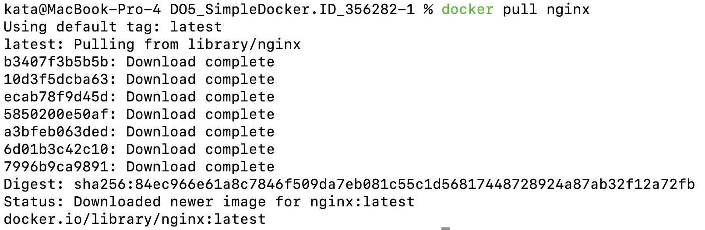    
		- Скриншот который показывает установку nginx    
   
- 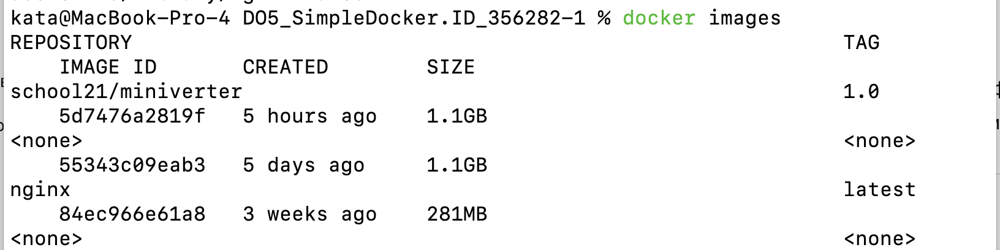    
	- Скриншот который показывает успешную установку nginx   
   
- 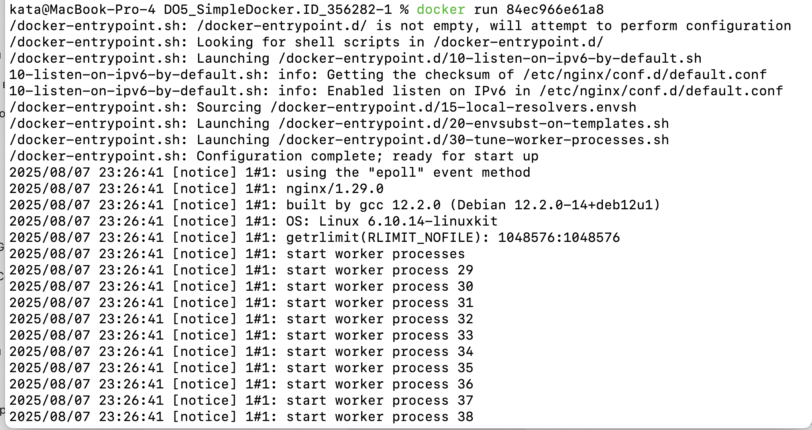    
	- Скриншот вывода команды docker run [id nginx]   
   
- 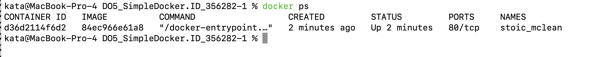    
	- Скриншот вывода команды docker ps где видно что образ запустился    
   
-     
	- Скриншот вывода команды docker inspect    
   
	- size был добавлен потому что иначе не расчитывался размер    
   
	- Размер около 202 мб    
	- Замапленных портов нет    
   
		- "ExposedPorts": {            
  	   "80/tcp": {} 

	- айпи 172.17.0.2   
   
   
- 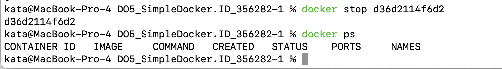    
	- Скриншот с остановкой контейнера   
   
- 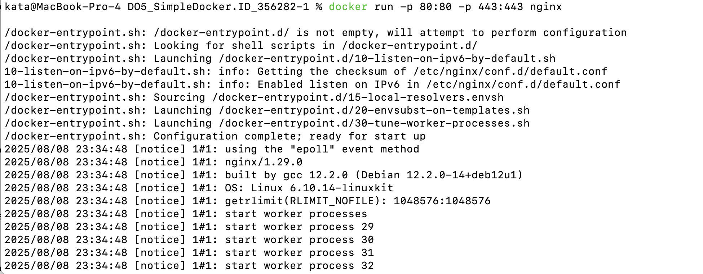    
	- Скриншот с запуском контейнера с портами

   
- 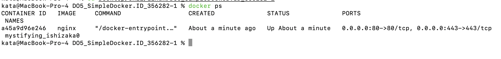    
	- Скриншот вывода команды docker ps где видно что все запустилось   
   
- 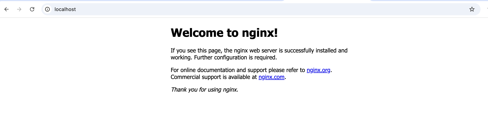    
	 - Скриншот где видно что в браузере стала доступна стартовая страница nginx   
-     
	- Скриншот где видно адрес    
- 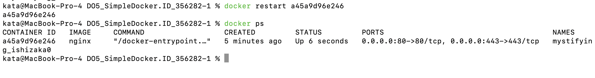    
	- Скриншот перезапуска контейнера + проверки того что контейнер запустился    
   
## Part 2. Операции с контейнером    
   
- 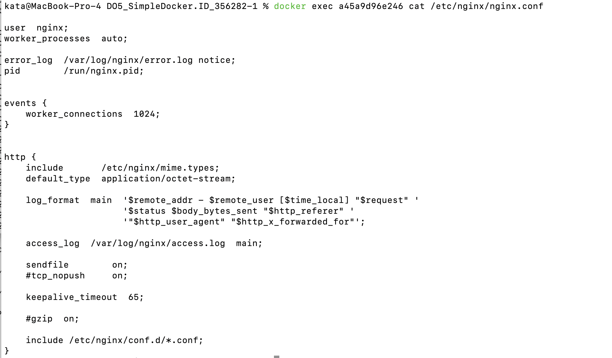    
	- Скриншот содержания конфигурационного файла    
   
- 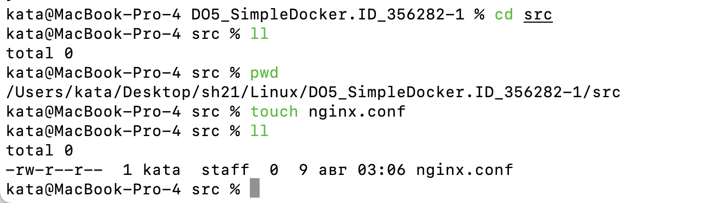    
	 - Скриншот создания файла nginx.conf   
   
- 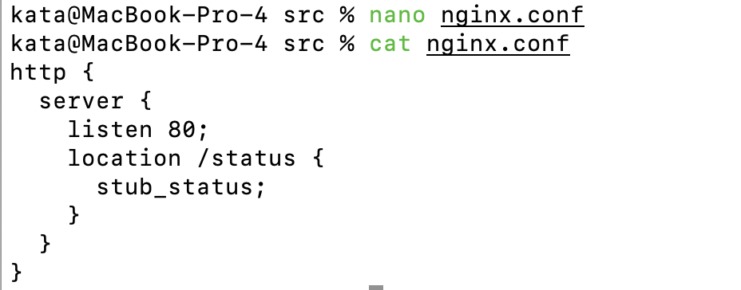    
	- Скриншот содержания конфиг файла для отображения статуса   
- 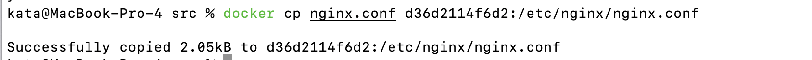    
	- Скриншот который показывает копирование кофига вовнутрь докер образа    
- 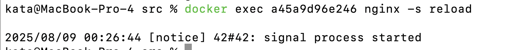    
	- Скриншот перезагрузки   
- 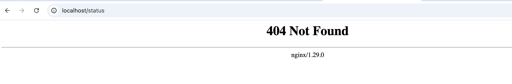    
	 - Скриншот неудачного открытия    
- 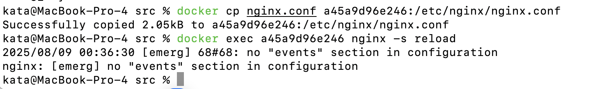    
	- Скриншот поиска ошибки    
	- Я решила попробовать скопировать еще раз и перезапустить nginx, вылезла ошибка что нет секции events в конфиге
   
- 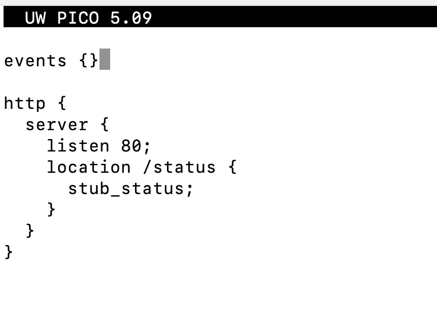    
	- Скриншот обновленного конфига   
   
- 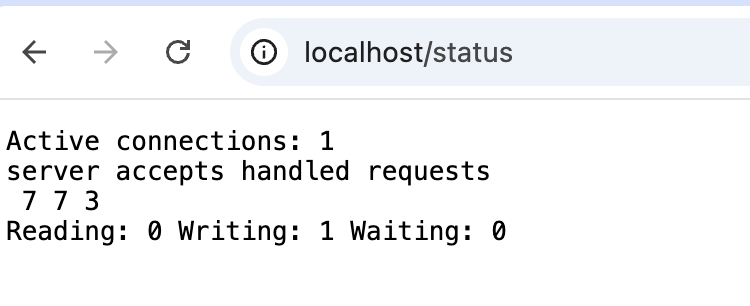    
	- Скриншот успешного вывода статуса сервера   
   
- 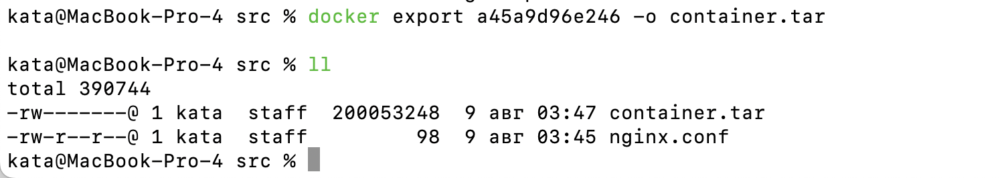    
	 - Скриншот экспорта контейнера   
- 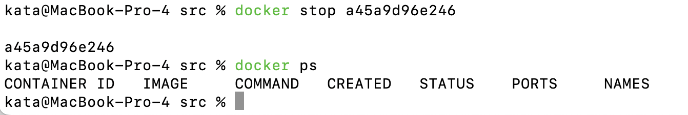    
	- Скриншот остановки контейнера    
- 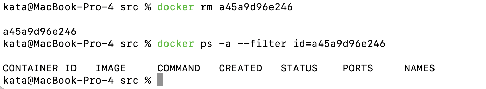    
	- Скриншот удаления контейнера    
- 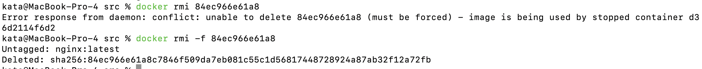    
	- Скриншот удаления образа
	- Понадобилось использовать -f (force) потому что докер ругался что более ранний контейнер ссылается на этот образ   
   
- 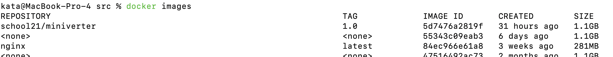    
	- Скриншот до удаления образа где видно nginx   
- 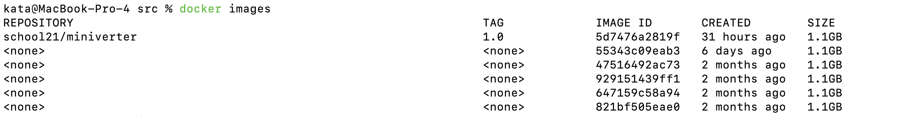    
	- Скриншот после удаления образа где видно его отсутствие    
- 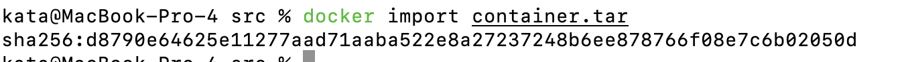    
	- Скриншот импорта контейнера    
- 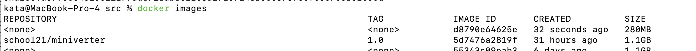    
	- Скриншот вывода команды docker images после импорта    
-     
	- Скриншот запуска контейнера    
	- Надо было добавить -g "daemon off" чтобы контейнер сразу не завершался потому что в конфиге который я написала не было этой строки и он сразу падал.    
- 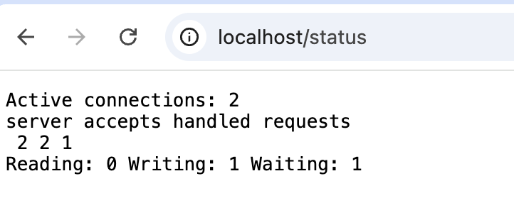    
	- Скриншот странички со статусом сервера   
   
   
