# DO6   
   
part1 


   
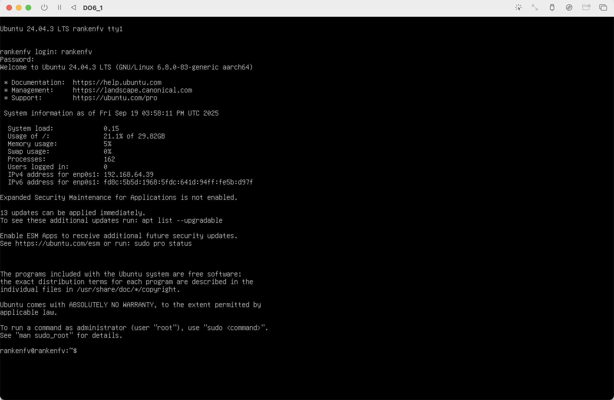    
первым делом я установила виртуалку без граф интерфейса   
   
- Дальше я проверила пакеты которые нужны для установки GitLab Runner   
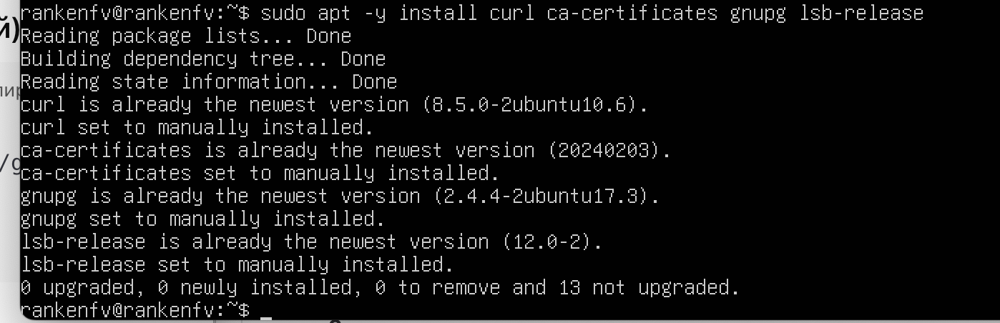    
   
sudo apt -y install curl ca-certificates gnupg lsb-release

   
Это «подготовительные» пакеты — без них установка репозитория GitLab Runner часто спотыкается.   
- **curl** — скачиваем скрипт подключения репозитория GitLab ( `.../script.deb.sh`) и вообще любые файлы по HTTPS.   
- **ca-certificates** — набор корневых сертификатов. Нужен, чтобы `curl` и `apt` доверяли HTTPS-сайту (иначе получите ошибки типа *SSL certificate problem*).   
- **gnupg** — инструменты GPG. Нужны `apt`/скрипту, чтобы импортировать и проверить **подпись** репозитория/пакетов GitLab (без этого `apt` ругается на недоверенные источники).   
- **lsb-release** — утилита, которая сообщает кодовое имя дистрибутива (например, `jammy`). Скрипт GitLab использует его, чтобы записать корректную строку репозитория для именно твоей версии Ubuntu.   
   
Они уже были установлены и обновлены до последней версии

   
### 1) Установка gitlab-runner на Ubuntu 22.04   
```

# обновить списки пакетов и поставить нужные утилиты
sudo apt update
sudo apt -y install curl ca-certificates gnupg lsb-release

# подключить офиц. репозиторий GitLab Runner и установить пакет
curl -L https://packages.gitlab.com/install/repositories/runner/gitlab-runner/script.deb.sh | sudo bash
sudo apt -y install gitlab-runner


```
###    
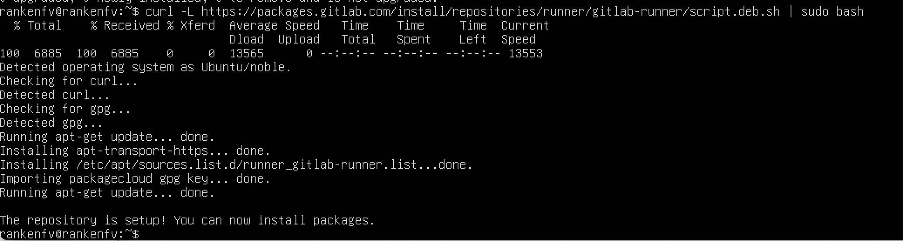    
Подключила репо гитлаб раннера   
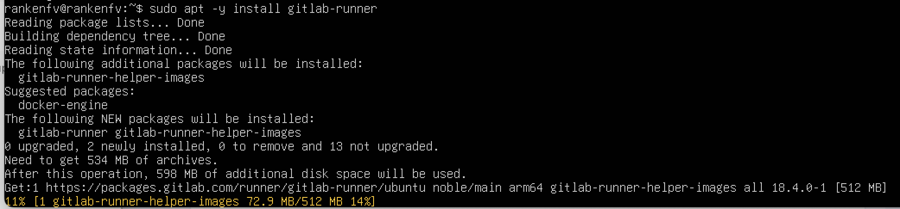    
sudo apt -y install gitlab-runner   
установила пакет   
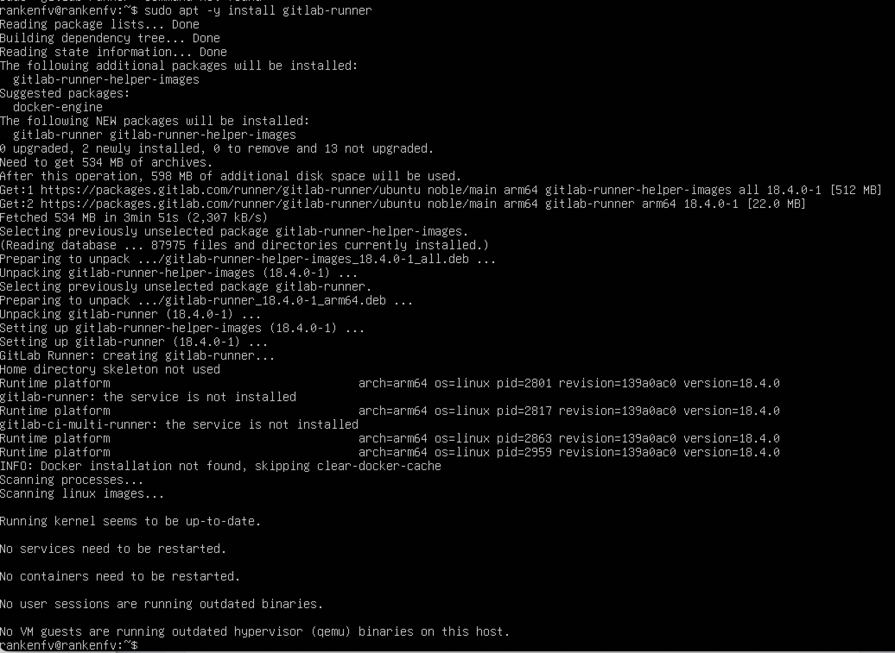    
Вот полный скрин успешной установки   
    
Проверка успешной установки с через проверку версии   
   
### 

2) Регистрация раннера для проекта DO6\_CICD   
```

sudo gitlab-runner register
# URL:   https://git.21-school.ru
# Token: <твой токен со страницы задания>
# Description:   kata-runner (или любое)
# Tags:          (просто Enter)
# Executor:      shell


```
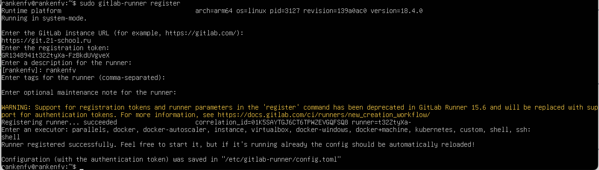    
Дальше я зарегистрировала gitlab runner   
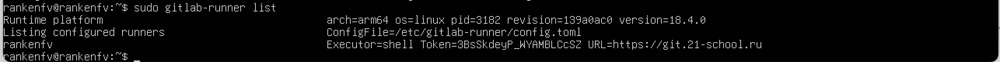    
После этого проверила    
Что делает команда **`sudo gitlab-runner list`:**   
Показывает **список раннеров, сконфигурированных на этой ВМ**, то есть записи из файла `/etc/gitlab-runner/config.toml`. Это не проверка связи с GitLab, а просто вывод того, что у тебя зарегистрировано локально.   
   
### 3) Запуск gitlab-runner (без автозапуска)   
```

sudo systemctl start gitlab-runner
sudo systemctl status gitlab-runner --no-pager


```
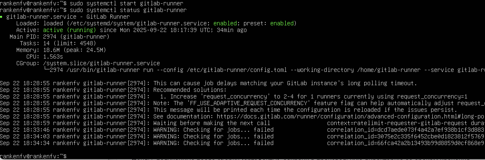    
###    
Первая команда используется для старта, вторая для проверки того что сервис запущен.   
   
   
   
   
# Part\_2   
   
я подключила виртуалку к гитлабу, склонировала репозиторий. Со своего обычного компа я запушила файлы с кодом. Также на нем для удобства я написала gitlab-ci.yml, запушила. Пайплайн сразу упал

я поресерчила и узнала что такое бывает когда на виртуалке где запущен раннер нет нужных иструментов для сборки. Я это проверила 

   
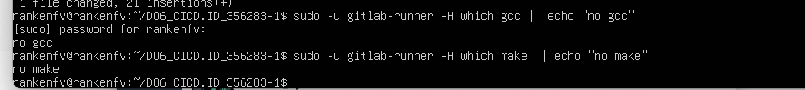    
Там правда не оказалось gcc и make   
   
Поэтому я поставила пакет build-essential (туда входит и gcc и make)   
   
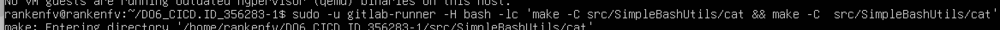    
Я использовала команду 
sudo -u gitlab-runner -H bash -lc 'make -C src/SimpleBashUtils/cat clean && make -C src/SimpleBashUtils/cat'

   
чтобы посмотреть где падает сборка    
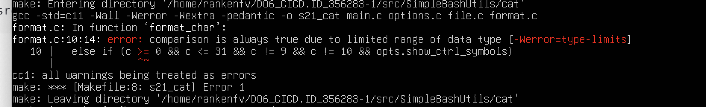    
Оказывается у меня в проекте шло неправильное сравнение
Я поменяла код на    
else if (c <= 31 && c != 9 && c != 10 && opts.show\_ctrl\_symbols)

убрала проверку с <= 0 потому что это условие всегда верно 


   
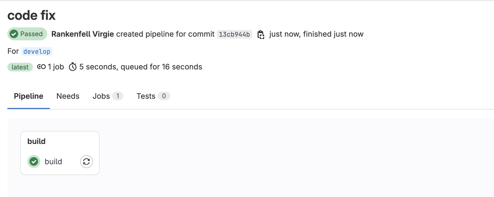    
после этого билд прошел   
   
также из билда можно скачать артефакты, это исполняемые файлы s21\_cat и s21\_grep   
   
### Part\_3   
   
На виртуалке установила clang format   
    
дальше начала редактировать файл    
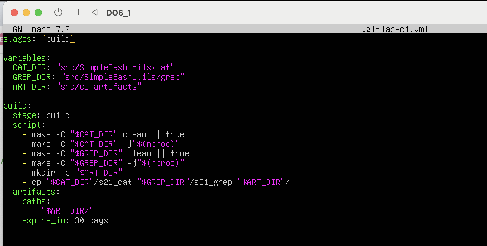    
Файл до изменений   
   
   
   
   
- `set -e`   
    Флаг `-e` для шелла: **останавливает** скрипт при любой команде с ненулевым кодом возврата.   
    Почему это не роняет job на строке с `diff`? — потому что там мы используем `... \|\| status=1` (см. ниже), и итоговый статус составной команды становится 0, значит `set -e` не срабатывает.   
- `STYLE="-style=file"; [ -f .clang-format ] \|\| STYLE="-style=Google"`   
    - `-style=file` — флаг **clang-format**: брать правила форматирования из файла `.clang-format` в репозитории (ищется вверх по дереву).
   
    - `[ -f .clang-format ]` — тест шелла: флаг `-f` означает «существует и это **обычный файл**».   
    - `\|\|` — «ИЛИ» в шелле: правая часть выполняется **только если** левая завершилась с ошибкой (файл не найден).   
    - В итоге, если `.clang-format` есть → используем `-style=file`, иначе переключаемся на встроенный профиль `-style=Google`.   
   
    У **clang-format** с флагом `-style=file` он ищет `**.clang-format**`** начиная из папки самого файла и поднимаясь вверх по дереву каталогов** до корня.   
     Значит, если есть `**src/.../cat/.clang-format**` и `**src/.../grep/.clang-format**`, то файлы из `cat` возьмут конфиг из `cat/.clang-format`, а файлы из `grep` — из `grep/.clang-format`. Это **нормально и поддерживается**.   
- `files="$(git ls-files '\*.c' '\*.h')"`   
    - `git ls-files` — выводит **только отслеживаемые** гитом файлы (никакого мусора).   
    - Шаблоны `'\*.c' '\*.h'` в **кавычках**: это важно, чтобы расширение делал **git**, а не оболочка.   
    - `$( ... )` — подстановка команды: результат кладём в переменную `files`.   
- `if [ -z "$files" ]; then ...; exit 0; fi`   
    - `-z` — тест на **пустую строку**.   
    - Если C/H файлов нет — печатаем сообщение и `exit 0` (зелёный выход), чтобы не валить пайплайн пустой проверкой.   
- `status=0`   
    Локальный «флаг ошибок». Будем делать `status=1`, если найдём расхождения.   
- `for f in $files; do clang-format $STYLE "$f" \| diff -u "$f" - \|\| status=1; done`   
    - `clang-format $STYLE "$f"` — форматируем **в поток** (stdout), **не меняя файл**.   
    - `diff -u "$f" -` — сравниваем оригинал ( `"$f"`) с тем, что пришло из **stdin** ( `-`).   
        - флаг `-u` у `diff` = **unified diff**: удобный формат патча с контекстом.   
    - `\|\| status=1` — если `diff` нашёл различия, он вернёт код `1`; тогда правая часть выполнится и мы отметим, что были нарушения. Благодаря `\|\| ...` вся составная команда возвращает **0**, и `set -e` не прервёт цикл — мы покажем дифф **для всех** файлов.   
- `if [ $status -ne 0 ]; then ...; exit 1; fi`   
    - `-ne` — «численно **не равно**». Если были отличия → валим job.   
    - В сообщении подсказка про `clang-format -i`:   
        - флаг `-i` у **clang-format** — **in-place**: применяет форматирование прямо к файлам.   
   
После того как запушила пайплайн зафейлился потому что была ошибка в синтаксисе
ошибка 1   
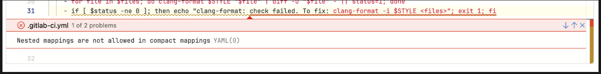    
ошибка 2   
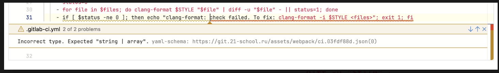    


Исправила ее путем добавления одинарных кавычек чтобы yaml не ругался и воспринимал это как строку 

   
    
Пайплайн упал 

   
    
предположительно пайплайн упал потому что clang-format не прошел. Но тут видно что изначальная идея с тем чтобы отображались файлы которые не прошли стайл чек не сработала и он просто выводит строку, то есть переменная не подхватывается   
   
\_\_\_\_\_\_\_\_\_\_\_\_\_\_\_\_\_\_\_\_\_\_\_\_\_\_\_\_\_\_\_\_\_\_\_\_\_\_\_\_\_\_\_\_\_\_\_\_\_\_\_\_\_\_\_\_\_\_   
   
```
code_style:
  stage: style
  script:
    - set -e
    - 'STYLE="-style=file"; [ -f .clang-format ] || STYLE="-style=Google"'
    - files="$(git ls-files '*.c' '*.h')"
    - 'if [ -z "$files" ]; then echo "No .c/.h files to check"; exit 0; fi'
    - status=0
    - 'for file in $files; do echo ">>> checking $file"; clang-format $STYLE "$file" | diff -u "$file" - || status=1; done'
    - 'if [ $status -ne 0 ]; then echo "clang-format: check FAILED"; echo "To auto-fix locally:"; echo "  clang-format -i $STYLE $files"; exit 1; fi'

```
Поэтому я поправила файл   
что было сделано:
- обернула строки где выводится текст в одинарные кавычки   
- теперь печатается diff >>> checking $file и выводится файл   
- поменяла на` $STYLE $files` чтобы выводилась реальная переменная (название файла)    
   
   
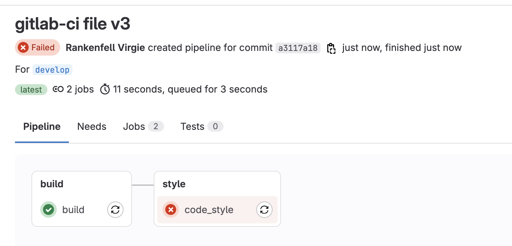    
пайплайн зафейлился
вот лог 

   
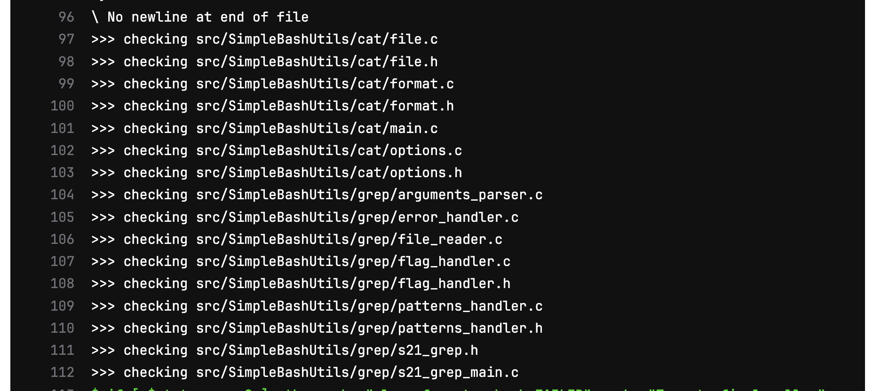    
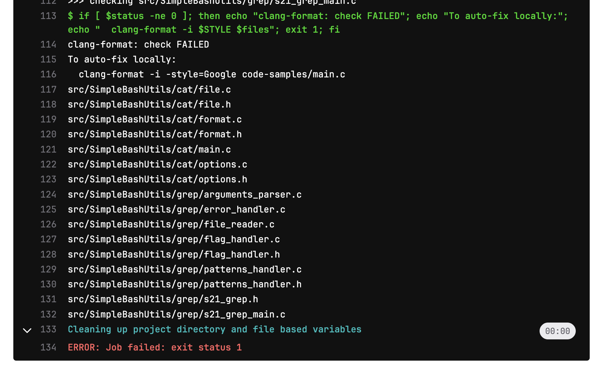    
тут предположительно все отрабатывает как надо, но фейлится кодстайл


   
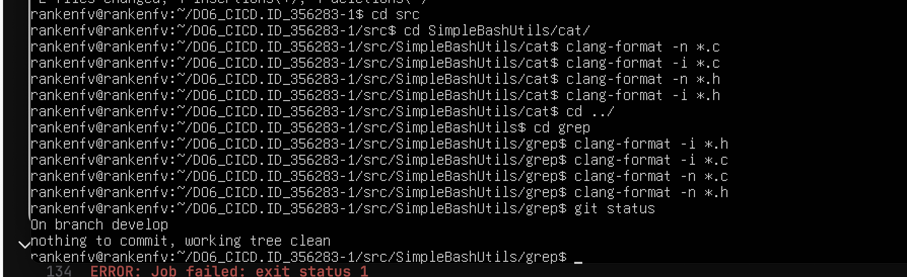    
странно потому что локально нет ошибок clang формата
   
   
я подумала что наверное потому что отрабатывает строка где если не нашелся файл clang, то тогда по умолчанию используем гугл стайл. И используется он, а у него другая версия.
Поэтому я отредактировала файл, убрала бекап    
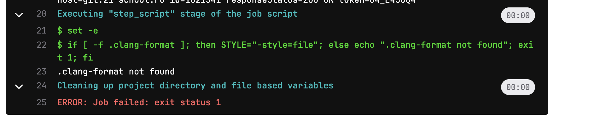    
после этого начало падать потому что не находится clang format 

После этого я решила поменять синтаксис чтобы пайплайн фейлился если не находит локальный силанг потому что идея с бекап гугл силангом была с подводным камнем потому что тогда если разница версий то локально могут не вылезать ошибки, в то время как пайнлайн может фейлиться как это было в первом тесте. 

теперь - 

   
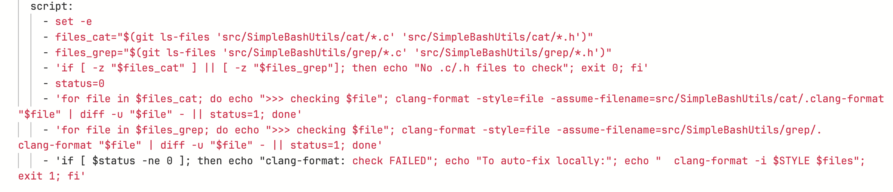    
синтаксис такой. Явно указаны пути сборки для cat и grep и откуда брать силанг    
   
после этого пайплайн прошел   
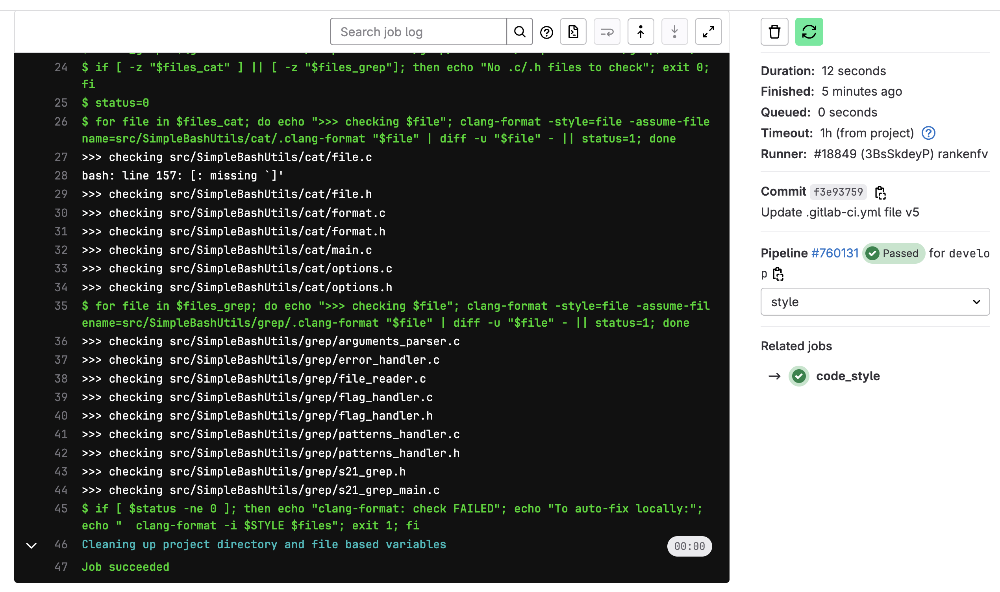    
пуш назывался update gi yml v 5 или что-то по типу этого    
   
   
   
## Part 4   
   
добавила кусок с тестами   
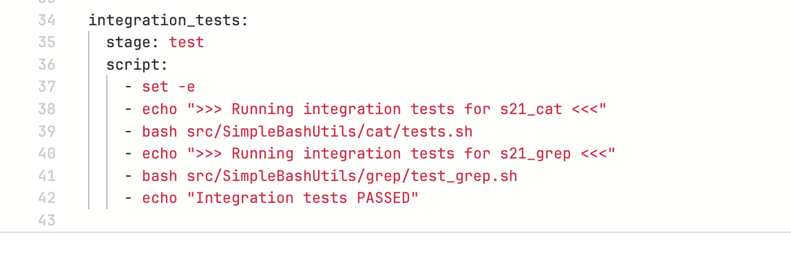    
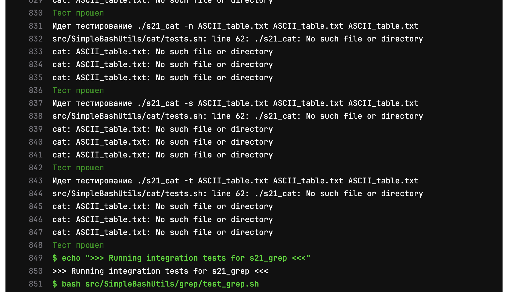    
тесты прошли, решила добавить явный вывод в случае если тесты не прошли    
    
добавила часть с явным фейлом   
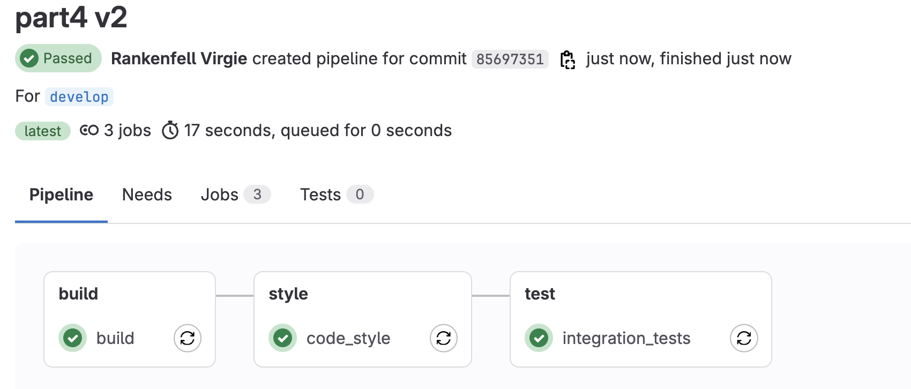    
пайплайн прошел   
   
добавила фейл в кат для проверки   
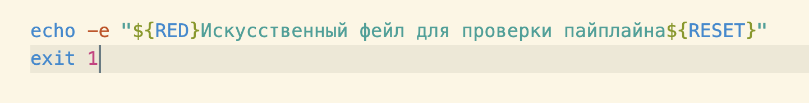    
   
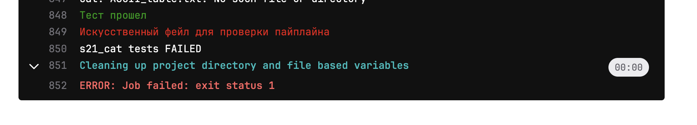    
пайплайн зафейлился    
    
   
   
убрала вечную ошибку, пайплайн прошел   
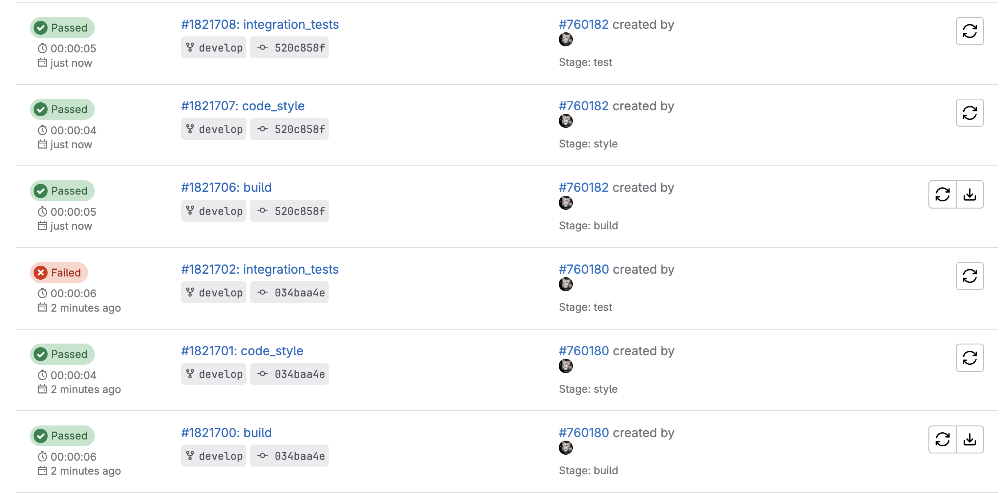    
то что внизу 2 зеленых + 1 красный это с прошлого этапа тестирования для сравнения работы   
   
   
   
на этом моменте я поняла что использовала неправильную версию - 24 04, а надо было 22 04. Поэтому я повторила первую часть для новой машины с правильным ПО   
    
Единственное сразу установила ssh сервер   
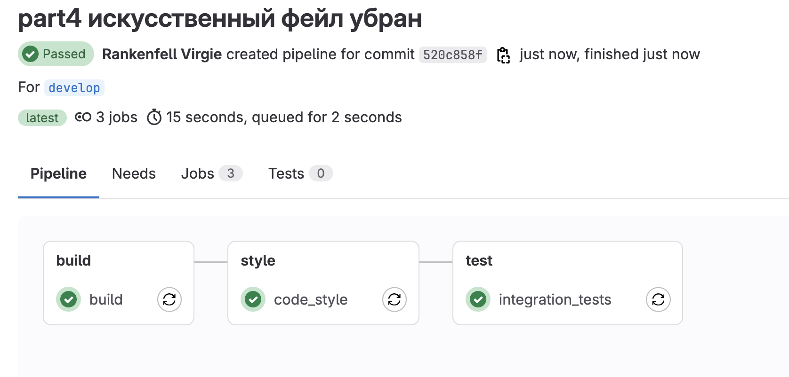    
Подняла новую машину, настроила ее, склонировала репозиторий. Выключила старый раннер, после чего прогнала пайнлайн. Он не упал. На основании этого сделала вывод о том что все настроено успешно и можно переходить к след части

   
### Part 5
   
   
На второй машине установила ssh клиент и сервер   
`openssh-client` нужен для `ssh` и `scp` команд,   
`openssh-server` нужен, чтобы на машину можно было **подключаться извне**.


   
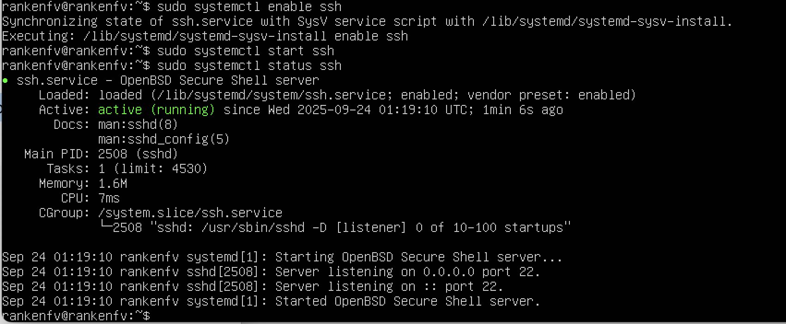    
Скриншот старта ssh + проверки того что сервис запустился   
   
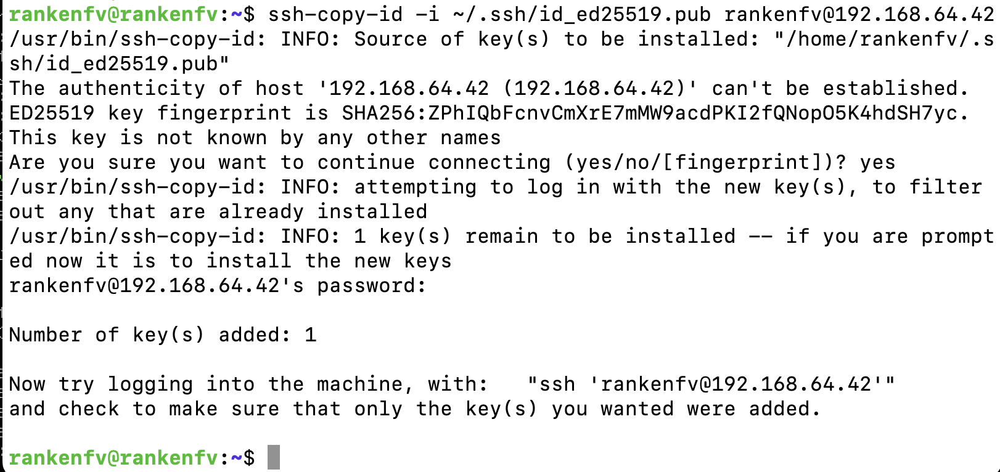    
Далее с первой машины DO6\_deploy я скопировала на вторую машину ssh ключ

   
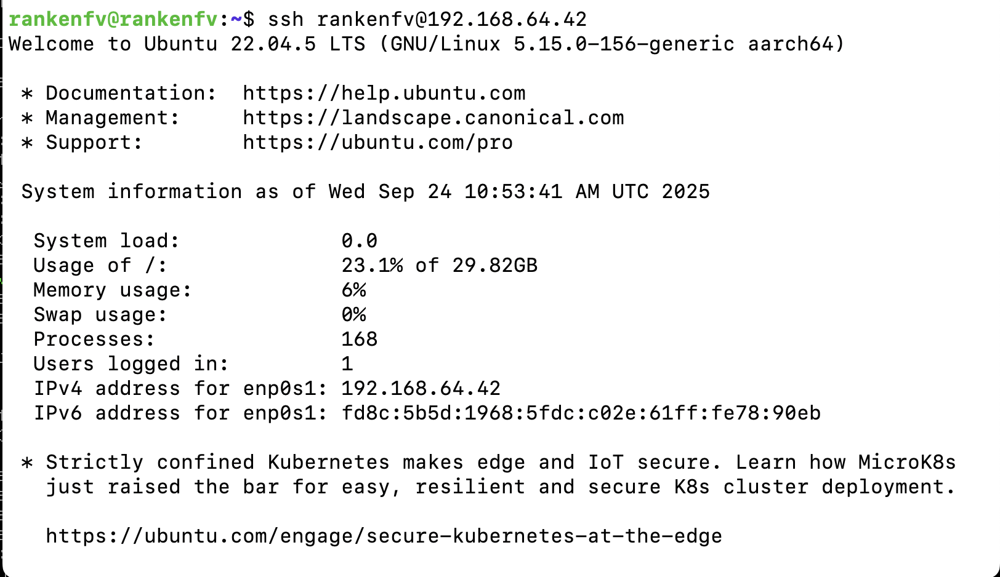    
с первой машины проверила вход, все ок   
   
   
   
так как я в gitlab-ci.yml файле прописала что деплой по мануальному действию, то пайплайн ждет моего действия для разворачивания    
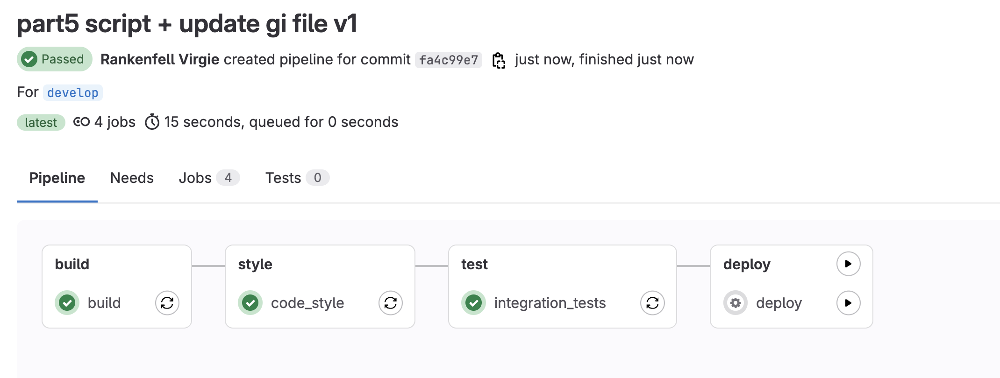    
скриншот работы пайплайна   
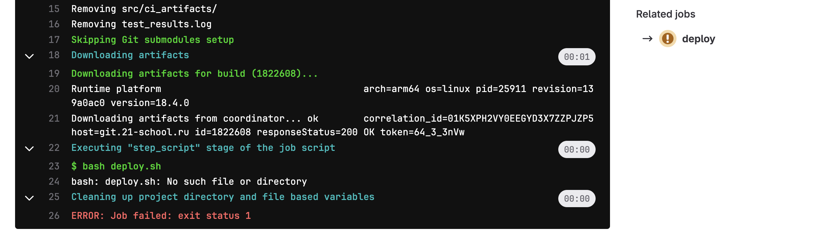    
в первый раз зафейлилось потому что неправильно указала путь к скрипту деплоя, надо было src/deploy.sh, а я прописала просто deploy.sh   
   
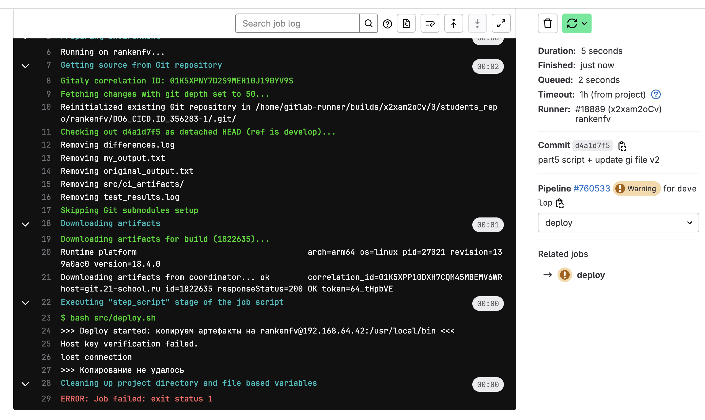    
Попытка 2: обновила путь, файл стал находиться, но не подключалось. 


   
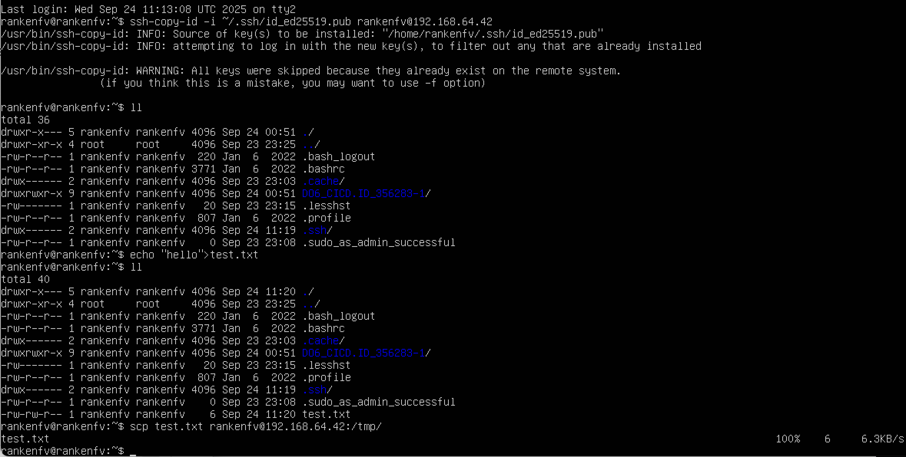    
Проверила что подключение без пароля, на всякий случай еще раз скопировала ssh ключ
Вручную копирование работает без пароля 

   
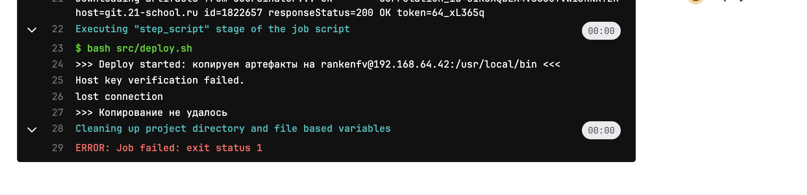    
Но пайплайн опять упал по той же причине    
    
Возникла гипотеза что это из-за того что gitlab runner работает от другого пользователя где ключи и доступы не настроены    
   
Я пересоздала пару ключей, после этого появилась другая проблема

   
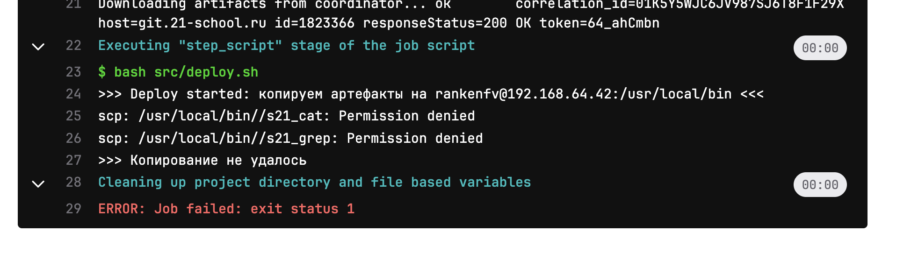    
она произошла потому что rankenfv не имеет права писать в рутовую папку   
   
```
#!/bin/bash
set -e

USER="rankenfv"
HOST="192.168.64.42"
TARGET_DIR="/usr/local/bin"
ART_DIR="src/ci_artifacts"
TMP_DIR="/tmp/deploy_tmp"

echo ">>> Deploy started: копируем артефакты на $USER@$HOST <<<"

# 1. Копируем во временный каталог
if scp -P 22 "$ART_DIR"/s21_cat "$ART_DIR"/s21_grep "$USER@$HOST:$TMP_DIR/"; then
  echo ">>> Файлы скопированы во временный каталог $TMP_DIR"
else
  echo ">>> Ошибка при копировании во временный каталог"
  exit 1
fi

# 2. Перемещаем в /usr/local/bin с root-правами
if ssh -p 22 "$USER@$HOST" "sudo mkdir -p $TARGET_DIR && sudo mv $TMP_DIR/s21_* $TARGET_DIR/ && sudo chmod +x $TARGET_DIR/s21_*"; then
  echo ">>> Файлы успешно развернуты в $TARGET_DIR"
else
  echo ">>> Ошибка при перемещении файлов в $TARGET_DIR"
  exit 1
fi

echo ">>> Deploy finished SUCCESS <<<"

```
Поменяла немного скрипт - если до этого сразу создавалось в папке в которой не было прав на создание, то теперь в начале создается во временном каталоге и потом перемещается в необходимую директорию с рут правами   
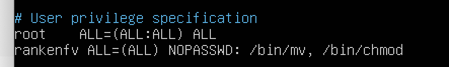    
Также на второй машине добавила пользователя `rankenfv` в группу `sudo`, чтобы он мог выполнять `sudo` без пароля для `mv` и `**chmod


**`   
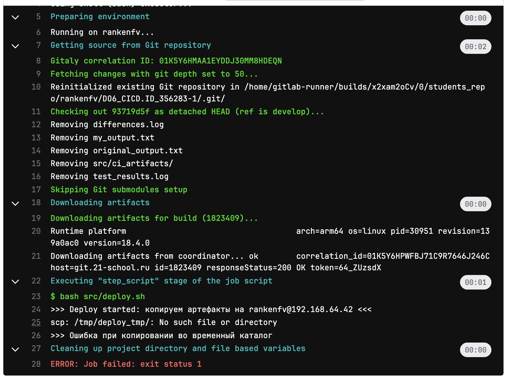    
Проблема с правами ушла, но появилась с тем что нет директории


Я решила сделать временный каталог для чистоты копирования чтобы точно не было такого что часть записалась, а часть нет   
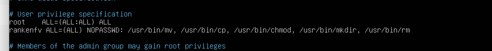    
обновила права потому что команды были указаны по неправильному пути

   
все равно не работало 


   
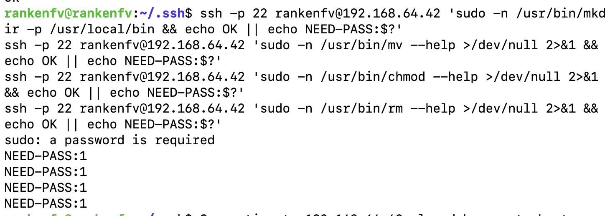    
Затестила требуется ли пароль или нет, требовался

   
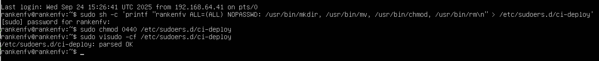    
потом переписала это в отдельный файл правил доступа   
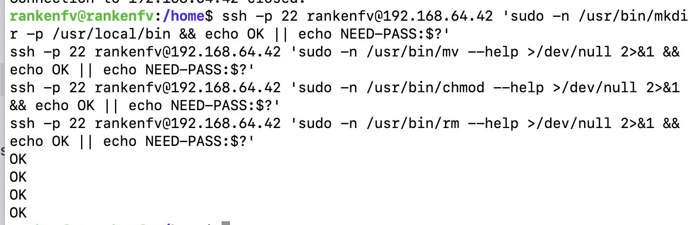    

После этого стало выводиться ок   
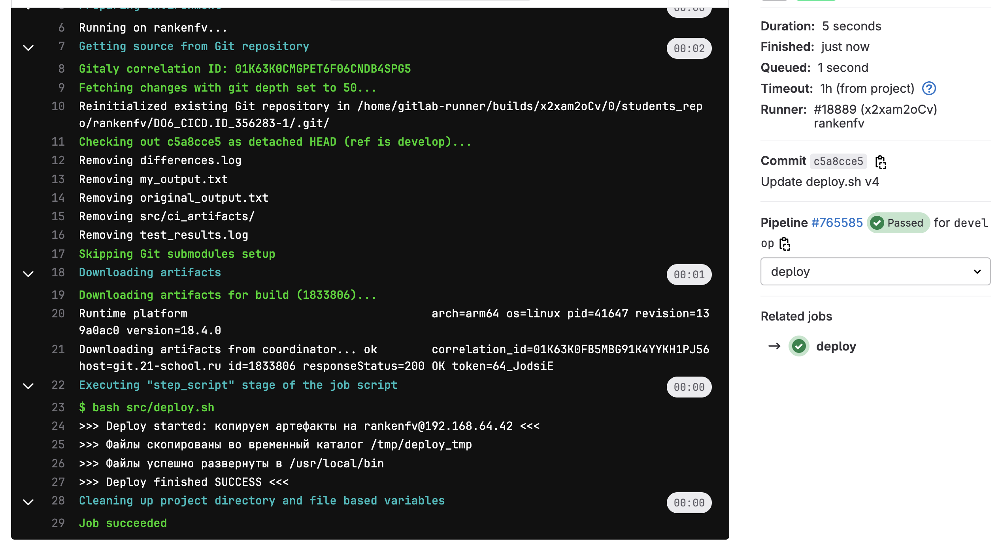    
после этого пайплайн сработал 


   
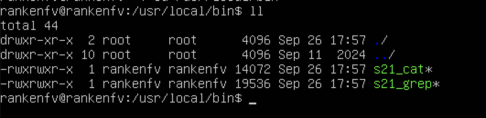    
На второй машине по указанному пути появились программы 

   
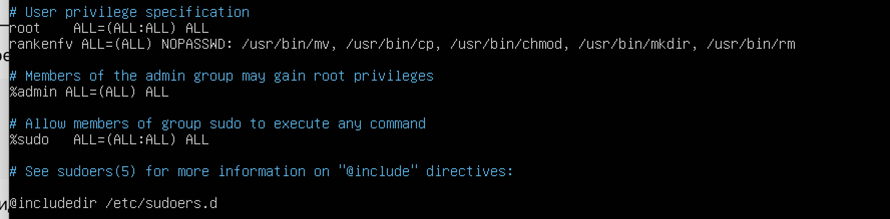    
Проблема по всей видимости была в том что мои кастомные правила не шли в самом низу и перекрывались другими правилами (последнее правило - в приоритете) 
Но когда я вынесла это все в отдельный файл, то именно он стал в приоритете и поэтому начало работать

Part\_6   
   
   
1 - В начале я создала тг бота через BotFather
2 - Посмотрела токен доступа
3 - Посмотрела чат id через https://api.telegram.org/bot<BOT\_TOKEN>/getUpdates

   
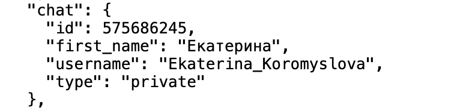    
так как на гитлабе у меня нет доступа к переменным для настройки CI/CD, передо мной стоял выбор - загрузить скрипт с секретами(токен тг и тд) в гитлаб, либо передать эти данные в переменные окружения раннера. 
Для безопасности я решила передавать переменные в окружение раннера. 

   
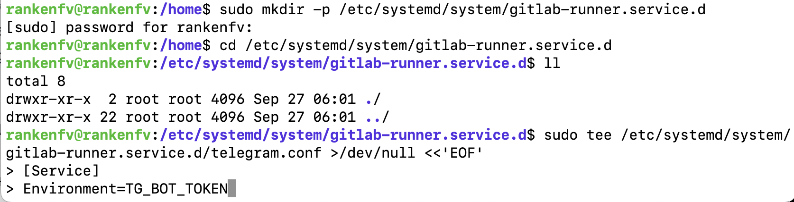    
Скриншот того что я делала 
   
```
sudo tee /etc/systemd/system/gitlab-runner.service.d/telegram.conf >/dev/null <<'EOF'
[Service]
Environment=TG_BOT_TOKEN=xxxxxxxxxxxxxxxxxxxxxxxxxxxxx
Environment=TG_CHAT_ID=123456789
EOF
```
Вот полная команда которую я использовала 

   
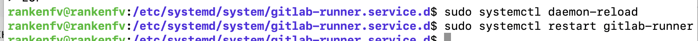    
Далее я перезагрузила сервис
Далее с помощью этой команды я проверила доступность переменных раннеру
   
```
sudo systemctl show gitlab-runner -p Environment | tr ' ' '\n' | grep TG_
```
Вывелись переменные с данными токена и айди чата
Далее я создала скрипт    
```
#!/bin/bash
set -e

# секреты из окружения
: "${TG_BOT_TOKEN:?missing TG_BOT_TOKEN in runner env}"
: "${TG_CHAT_ID:?missing TG_CHAT_ID in runner env}"

# читаем флажки от стадий
build_status="failed";  [ -f ci_status/build_ok ]  && build_status="passed"
style_status="failed";  [ -f ci_status/style_ok ]  && style_status="passed"
tests_status="failed";  [ -f ci_status/tests_ok ]  && tests_status="passed"

# deploy: passed если есть флаг; если CI не весь зелёный — not run; иначе skipped (не запускали вручную)
if [ -f ci_status/deploy_ok ]; then
  deploy_status="passed"
else
  if [ "${build_status}${style_status}${tests_status}" != "passedpassedpassed" ]; then
    deploy_status="not run"
  else
    deploy_status="skipped"
  fi
fi

message_text="$(printf '%s DO6 CI/CD\nCI: build=%s, style=%s, tests=%s\nCD: deploy=%s\n%s' \
  "${CI_PROJECT_PATH}" \
  "${build_status}" "${style_status}" "${tests_status}" \
  "${deploy_status}" \
  "${CI_PIPELINE_URL}")"

# отправка в Telegram
curl -sS -X POST "https://api.telegram.org/bot${TG_BOT_TOKEN}/sendMessage" \
  -d chat_id="${TG_CHAT_ID}" \
  --data-urlencode "text=${message_text}" >/dev/null

echo "Telegram notification sent."

```
   
    
После чего сделала скрипт исполняемым   
`mkdir`: `-p` = создать все недостающие папки и не считать существование ошибкой.   
   
[Разбор скриптов](razbor-skriptov.md)    
